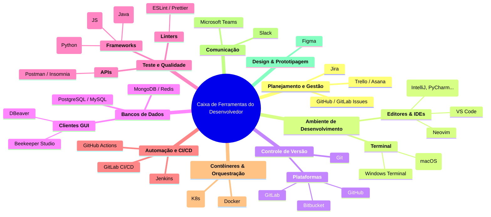

# 🛠️ Guia de Ferramentas Essenciais para Desenvolvedores

O universo do desenvolvimento de software é vasto e repleto de ferramentas, cada uma projetada para resolver um problema específico. Navegar por este ecossistema pode ser desafiador. Este guia apresenta as ferramentas e categorias mais importantes que formam a base da "caixa de ferramentas" de um desenvolvedor moderno.

A "melhor" ferramenta quase sempre depende do contexto: a linguagem de programação, o tamanho da equipe, a complexidade do projeto e a cultura da empresa.

-----

## 🗺️ O Mapa do Ecossistema de Ferramentas

-----

### 📝 Planejamento e Gestão de Projetos

Ferramentas que ajudam a organizar tarefas, rastrear bugs e gerenciar o fluxo de trabalho da equipe.

  - **Jira**: O padrão da indústria para equipes ágeis em ambientes corporativos. Altamente configurável, com quadros Scrum e Kanban.
  - **Trello / Asana**: Ferramentas mais visuais e simples, excelentes para equipes menores, projetos pessoais e gerenciamento de tarefas com quadros Kanban.
  - **GitHub / GitLab Issues**: Integrados diretamente à plataforma de código, são ideais para rastrear bugs e funcionalidades atreladas diretamente ao desenvolvimento.

### 💻 Ambiente de Desenvolvimento

Onde o código é efetivamente escrito.

  - **Editores de Código e IDEs**:
      - **Visual Studio Code (VS Code)**: O editor de código mais popular do mundo. É leve, rápido, gratuito e possui um ecossistema gigantesco de extensões que o adaptam para qualquer linguagem ou framework.
      - **IDEs da JetBrains**: Um conjunto de ambientes de desenvolvimento integrados (IDEs) extremamente poderosos e especializados por linguagem (ex: **IntelliJ IDEA** para Java, **PyCharm** para Python, **WebStorm** para JavaScript).
      - **Neovim / Vim**: Editores de texto baseados no terminal, amados por sua eficiência, velocidade e customização infinita para desenvolvedores que preferem não sair da linha de comando.
  - **Terminal**: A interface de linha de comando é uma ferramenta indispensável para qualquer desenvolvedor para executar comandos Git, gerenciar servidores e automatizar tarefas.

### 🗂️ Controle de Versão

Essencial para rastrear o histórico do código e colaborar.

  - **Git**: O sistema de controle de versão distribuído que é o padrão absoluto da indústria.
  - **GitHub / GitLab / Bitbucket**: As principais plataformas de hospedagem para repositórios Git, adicionando funcionalidades de colaboração como Pull/Merge Requests e revisão de código.

### 💾 Bancos de Dados

Ferramentas para armazenar e interagir com os dados da aplicação.

  - **Sistemas de Gerenciamento (SGBDs)**: **PostgreSQL** (SQL), **MySQL** (SQL), **MongoDB** (NoSQL), **Redis** (NoSQL Chave-Valor).
  - **Clientes GUI**: Aplicações visuais que facilitam a conexão, consulta e manipulação de bancos de dados sem a necessidade de usar apenas a linha de comando.
      - **DBeaver**: Um cliente de banco de dados universal e de código aberto que se conecta a praticamente qualquer tipo de banco de dados.
      - **Beekeeper Studio**: Uma alternativa moderna, de código aberto e com uma interface mais amigável.

### 🧪 Teste e Qualidade de Código

Ferramentas para garantir que o software funcione corretamente e siga padrões de qualidade.

  - **Frameworks de Teste**: Ferramentas específicas de cada linguagem para escrever e executar testes automatizados (ex: **Jest** para JavaScript, **PyTest** para Python, **JUnit** para Java).
  - **Clientes de API (Postman / Insomnia)**: Ferramentas essenciais para testar APIs de backend, permitindo enviar requisições HTTP customizadas e inspecionar as respostas.
  - **Linters e Formatadores**: Ferramentas que analisam o código estaticamente para encontrar problemas de sintaxe e garantir um estilo de código consistente em toda a equipe (ex: **ESLint** e **Prettier** para o ecossistema JavaScript, **Black** para Python).

### 🤖 Automação e CI/CD

Plataformas que automatizam o processo de build, teste e deploy do software.

  - **GitHub Actions / GitLab CI/CD**: Soluções de CI/CD modernas e poderosas, integradas diretamente às plataformas de hospedagem de código, que se tornaram o padrão para a maioria dos projetos novos.
  - **Jenkins**: O "veterano" do mundo da automação. É uma solução de código aberto extremamente poderosa e flexível, embora possa ser mais complexa de configurar e manter.

### 📦 Contêineres e Orquestração

Tecnologias que revolucionaram a forma como as aplicações são empacotadas e implantadas.

  - **Docker**: A plataforma líder para criar **contêineres**. Um contêiner empacota o código da aplicação e todas as suas dependências em uma unidade isolada e portátil, garantindo que ela rode da mesma forma em qualquer ambiente.
  - **Kubernetes (K8s)**: O padrão de fato para a **orquestração** de contêineres. Ele gerencia a implantação, o escalonamento e a operação de aplicações containerizadas em larga escala, automatizando tarefas complexas.

### 💬 Comunicação da Equipe

A colaboração eficaz é crucial para o sucesso de qualquer projeto de software.

  - **Slack / Microsoft Teams**: As duas principais plataformas de comunicação em equipe, permitindo conversas em canais, mensagens diretas e integração com outras ferramentas de desenvolvimento.

### 🎨 Design e Prototipagem

Ferramentas que fazem a ponte entre a ideia e a implementação visual.

  - **Figma**: A ferramenta líder de mercado para design de interfaces (UI), prototipagem interativa e, crucialmente, para o "handoff" — a entrega das especificações de design para os desenvolvedores.
