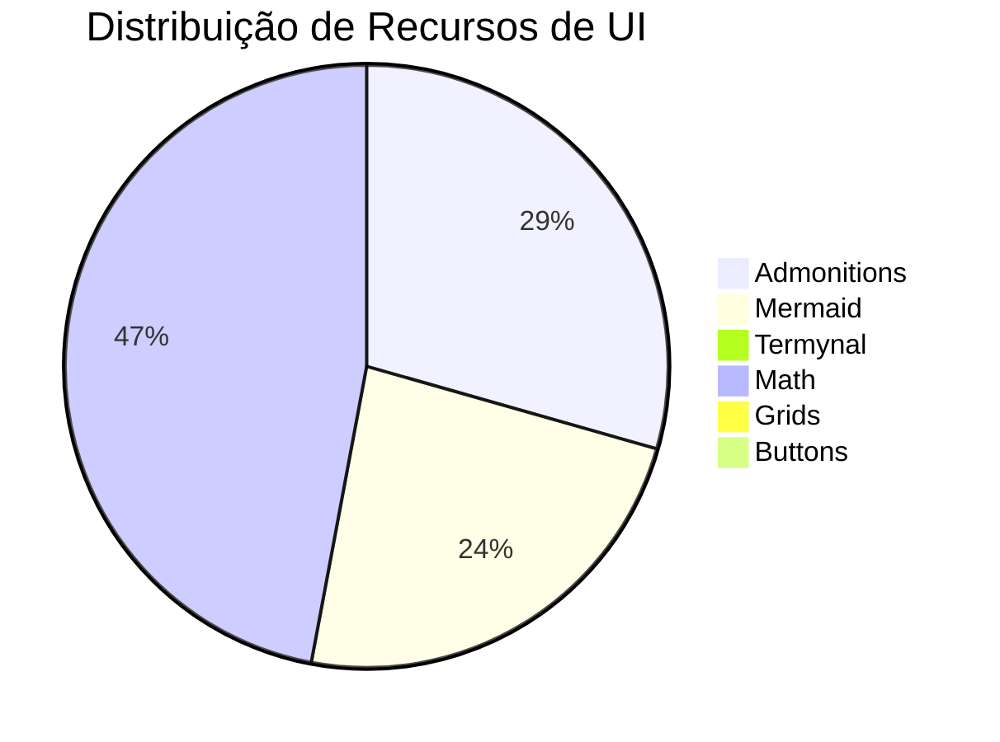

# 🛡️ Relatório de Auditoria Unificado

**Última Atualização:** 2026-03-03 21:03:14

## 🚀 Status do Deployment (GitHub Actions)

- **Último Run**: pages build and deployment (#22452037689)
- **Status**: ✅ completed (success)
- **Data**: 2026-02-26T16:50:01Z

## 🏗️ Infraestrutura (Padrão Ouro)

- ❌ **Navegação**: 5 abas obrigatórias presentes.
- ✅ **Identidade**: Logo em formato SVG.
- ✅ **Plugins**: `print-site` na última posição.
- ✅ **Segurança**: Pastas `src/` excluídas do build.

## 📊 Equilíbrio Pedagógico (Aulas 01-16)

A tabela abaixo mostra a contagem de recursos interativos por aula:

| Aula | Admonitions | Mermaid | Termynal | Math | Grids | Buttons |
|---|---|---|---|---|---|---|
| aula-01.md | 2 | 1 | 0 | 4 | 0 | 0 |
| aula-02.md | 2 | 1 | 0 | 2 | 0 | 0 |
| aula-03.md | 2 | 1 | 0 | 5 | 0 | 0 |
| aula-04.md | 1 | 1 | 0 | 8 | 0 | 0 |
| aula-05.md | 1 | 1 | 0 | 2 | 0 | 0 |
| aula-06.md | 1 | 1 | 0 | 1 | 0 | 0 |
| aula-07.md | 1 | 1 | 0 | 1 | 0 | 0 |
| aula-08.md | 1 | 1 | 0 | 1 | 0 | 0 |
| aula-09.md | 1 | 1 | 0 | 1 | 0 | 0 |
| aula-10.md | 1 | 1 | 0 | 2 | 0 | 0 |
| aula-11.md | 1 | 1 | 0 | 1 | 0 | 0 |
| aula-12.md | 1 | 1 | 0 | 1 | 0 | 0 |
| aula-13.md | 1 | 1 | 0 | 3 | 0 | 0 |
| aula-14.md | 2 | 1 | 0 | 0 | 0 | 0 |
| aula-15.md | 1 | 1 | 0 | 0 | 0 | 0 |
| aula-16.md | 1 | 1 | 0 | 0 | 0 | 0 |

### 📈 Visualização de Cobertura

## 🚀 Status da Build e Qualidade

### Checklist Final
- [ ] Build --strict sem warnings: ⚠️ Pendente
- [ ] Cobertura de 16 aulas: ✅
- [ ] Ativos (Slides/Quizzes) gerados: ✅ Verificado

!!! warning "Ajustes Necessários"
    Alguns critérios técnicos ou pedagógicos ainda não foram atingidos.
