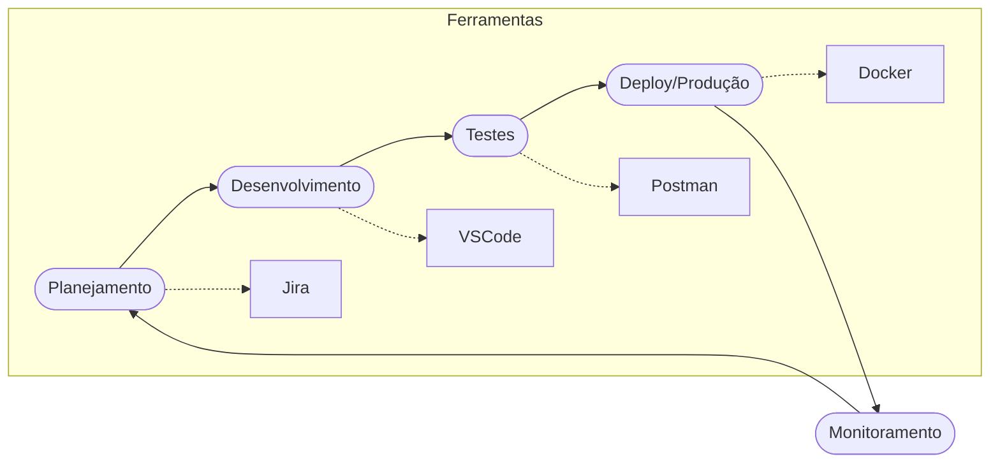

# Aula 01 - Introdução ao Ecossistema de Ferramentas 🌐

!!! tip "Objetivo"
    **Objetivo**: Compreender a importância das ferramentas no ciclo de vida de desenvolvimento de software e identificar as principais categorias de ferramentas utilizadas por equipes profissionais.

---

## 1. Por que as Ferramentas Importam? 🛠️

No desenvolvimento moderno, escrever código é apenas uma parte do trabalho. Para entregar software de forma eficiente, segura e colaborativa, utilizamos um conjunto de ferramentas que formam o nosso **ecossistema de desenvolvimento**.

### 🧠 Conceito: O Cinto de Utilidades do Dev

=== "Teoria"
    Assim como um marceneiro precisa de ferramentas especializadas para diferentes cortes e acabamentos, o ciclo de vida do software exige plataformas dedicadas. IDEs, controle de versão e pipelines formam uma cadeia de valor onde a saída de uma ferramenta alimenta a entrada da próxima.
    
=== "Prática"
    No seu dia a dia profissional, você não abrirá apenas o VS Code. Seu fluxo será: **Ler a Issue no Jira -> Criar branch no Git -> Escrever Código no VS Code -> Testar com Jest -> Subir um Pull Request no GitHub -> Ver o CI/CD (Actions) validar seu código**.

---

## 2. Categorias de Ferramentas 🗂️

Podemos dividir as ferramentas essenciais em grandes blocos:

1.  **Gestão e Organização**: Onde planejamos o que será feito (Jira, Trello).
2.  **Ambiente de Desenvolvimento**: Onde o código nasce (VS Code, Terminal).
3.  **Controle de Versão**: Onde guardamos o histórico e colaboramos (Git, GitHub).
4.  **Bancos de Dados**: Onde os dados residem (PostgreSQL, MongoDB).
5.  **Qualidade e Testes**: Onde garantimos que tudo funciona (Postman, Jest).
6.  **Infraestrutura e CI/CD**: Onde o código "vai pro mundo" (Docker, GitHub Actions).

### Visualização do Fluxo Profissional



---

## 3. A Importância da Automação 🤖

Uma das metas deste curso é ensinar você a parar de fazer tarefas repetitivas manualmente. 

!!! note "Conceito"
    **Automação** é o uso de ferramentas para executar processos que seriam lentos ou propensos a erro se feitos por humanos (ex: rodar todos os testes do sistema a cada alteração no código).

---

## 4. O Coração do Desenvolvimento: O Terminal 💻

Quase todas as ferramentas profissionais possuem uma interface de linha de comando (CLI). Dominar o terminal é o primeiro passo para se tornar um desenvolvedor avançado.

<div class="termy" markdown="1">
```termynal
$ echo "Bem-vindo ao Guia de Ferramentas!"
Bem-vindo ao Guia de Ferramentas!
$ git --version
git version 2.40.1
$ code --version
1.82.2
$ docker --version
Docker version 24.0.2
```
</div>

---

## 5. Prática: Diagnóstico do Cinto de Ferramentas 🚀

Sua primeira missão é verificar o que você já tem instalado e o que precisaremos configurar:

1.  Abra seu terminal (CMD, PowerShell ou Terminal do macOS/Linux).
2.  Tente executar os comandos: `git --version`, `code --version`, `docker --version`.
3.  Anote quais ferramentas responderam com a versão e quais não foram encontradas.
4.  Crie uma conta gratuita no **GitHub** caso ainda não possua.

---

## 📝 Prática Sugerida

Para consolidar o conhecimento desta aula, realize os exercícios propostos:

👉 **[Ver Exercícios da Aula 01](../exercicios/exercicio-01.md)**
👉 **[Ver Projeto da Aula 01](../projetos/projeto-01.md)**

---

**Próxima Aula**: Vamos aprender a organizar nosso fluxo de trabalho com o [Módulo 1 - Aula 02 - Gestão de Projetos](./aula-02.md)! 📊

