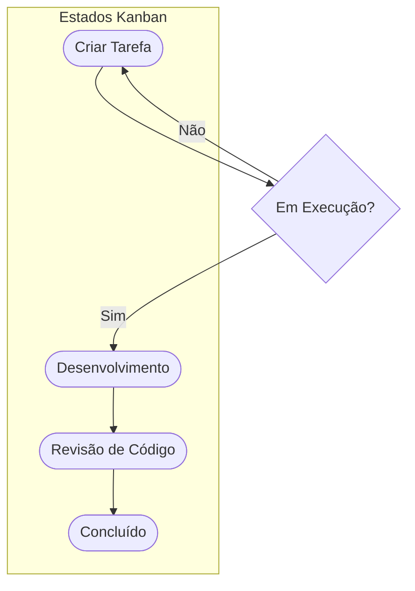

# Aula 02 - Gestão de Projetos e Tarefas 📊

!!! tip "Objetivo"
    **Objetivo**: Conhecer as principais ferramentas de gestão ágil, entender a diferença entre Scrum e Kanban e aprender a organizar o fluxo de trabalho de uma equipe de desenvolvimento.

---

## 1. Organização é Tudo! 📋

Um projeto de software moderno envolve centenas de tarefas, bugs e melhorias. Sem uma ferramenta de gestão, a equipe se perde em e-mails e mensagens de chat.

### 🧠 Conceito: Gestão Ágil

=== "Teoria"
    A maioria das ferramentas modernas baseia-se em metodologias ágeis (Agile). Diferente do modelo Cascata, o Agile foca em ciclos curtos de entrega (Sprints), feedback constante do cliente e transparência total sobre o que cada membro está desenvolvendo, garantindo previsibilidade.
    
=== "Prática"
    Nas dailys (reuniões diárias de 15 minutos), a equipe se reúne em frente ao quadro Kanban para responder: **O que eu fiz ontem? O que farei hoje? Existe algum impedimento bloqueando a minha tarefa?**

---

## 2. Ferramentas de Mercado 🏗️

### 🟦 Jira Software
O padrão da indústria para ambientes corporativos. Extremamente poderoso e configurável.
*   **Ideal para**: Equipes grandes de engenharia.
*   **Recurso chave**: Quadros Scrum (Sprints) e relatórios de métricas.

### 🟨 Trello / Asana
Ferramentas visuais baseadas em cartões. Muito simples e intuitivas.
*   **Ideal para**: Projetos menores, equipes multidisciplinares e organização pessoal.
*   **Recurso chave**: Sistema de "Arrastar e Soltar" (Drag and Drop).

### ⬛ GitHub / GitLab Issues
Integradas diretamente ao repositório de código.
*   **Ideal para**: Rastrear bugs e funcionalidades atreladas a linhas específicas de código.
*   **Recurso chave**: Linking de issues com Pull Requests.

---

## 3. O Quadro Kanban 🧱

O Kanban é a forma mais comum de visualizar o trabalho. Consiste em colunas que representam o status de cada tarefa.

### Fluxo Típico de Desenvolvimento



!!! info "Nota"
    O diagrama acima é uma representação visual simplificada do fluxo.

---

## 4. Criando sua Primeira Task 💻

Vamos simular a criação de uma tarefa no terminal, algo comum em ferramentas que possuem CLI ou integrações:

<div class="termy" markdown="1">
```termynal
$ jira issue create --summary "Configurar ambiente de dev" --priority High
Issue ADS-101 created successfully.
$ jira issue list --status "To Do"
ID       Summary                      Priority
ADS-101  Configurar ambiente de dev   High
ADS-99   Estudar Git                  Medium
```
</div>

---

## 5. Prática: Organizando seu Semestre 🚀

Sua missão é criar um quadro de gestão para suas atividades acadêmicas ou pessoais:

1.  Crie uma conta gratuita no **Trello**.
2.  Crie um quadro chamado "Organização ADS".
3.  Crie as colunas: **Backlog**, **Em Execução**, **Em Revisão** e **Concluído**.
4.  Adicione pelo menos 5 tarefas reais que você tenha para esta semana.
5.  Mova uma das tarefas para a coluna "Em Execução".

---

## 📝 Prática Sugerida

Para consolidar o conhecimento desta aula, realize os exercícios propostos:

👉 **[Ver Exercícios da Aula 02](../exercicios/exercicio-02.md)**
👉 **[Ver Projeto da Aula 02](../projetos/projeto-02.md)**

---

**Próxima Aula**: Vamos preparar nossa máquina com o [Módulo 1 - Aula 03 - Ambiente de Desenvolvimento](./aula-03.md)! 💻

