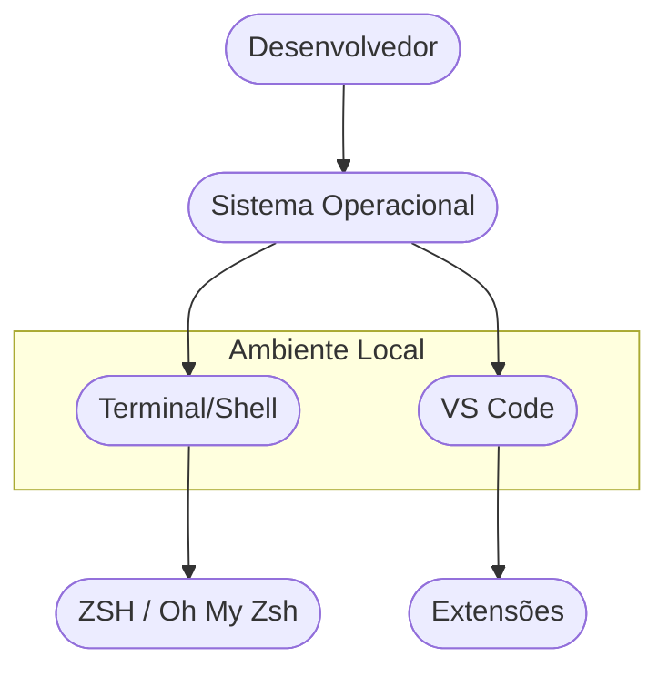

# Aula 03 - Ambiente de Desenvolvimento 💻

!!! tip "Objetivo"
    **Objetivo**: Customizar o ambiente de trabalho para máxima eficiência, conhecer a diferença entre Editores de Código e IDEs e dominar comandos básicos de terminal.

---

## 1. Editor vs IDE: Qual Escolher? 🧠

Embora pareçam iguais, ferramentas de escrita de código têm propósitos diferentes.

### 📄 Editores de Código (Ex: VS Code)
São leves, rápidos e "nascem" simples. Você os torna poderosos através de extensões.
*   **Vantagens**: Consome pouca memória, gratuito, ecossistema gigante.
*   **Desvantagens**: Exige configuração manual para algumas linguagens.

### 🏎️ IDEs - Ambientes Integrados (Ex: IntelliJ, PyCharm)

=== "Editores (Leveza)"
    Editores transferem a responsabilidade da configuração para o desenvolvedor. Eles carregam em milissegundos, consomem pouca RAM e são perfeitos para stacks modernas focadas em JavaScript/TypeScript.
    
=== "IDEs (Poder Nativo)"
    IDEs automatizam o *onboarding*. Ao criar um projeto Spring Boot (Java), a IDE já configura o *classpath*, baixa as dependências Maven, mapeia botões para o banco de dados e levanta as configurações de debug automaticamente. Seu custo é o alto consumo de recursos da máquina.

---

## 2. O Super Poder do VS Code 🚀

O **Visual Studio Code** é o editor mais popular do mundo. Para ele ser produtivo, você precisa do "kit básico" de extensões:

1.  **Portuguese (Brazil)**: Para traduzir a interface.
2.  **Material Icon Theme**: Para ícones de arquivos mais bonitos.
3.  **Prettier**: Para formatar seu código automaticamente.
4.  **Error Lens**: Para ver erros de código diretamente na linha.

---

## 3. Dominando o Terminal (CLI) ⌨️

O terminal é onde a magia acontece. Ele permite automatizar tarefas que levariam minutos na interface visual.

### Comandos Essenciais (Universal)

| Comando | Ação |
| :--- | :--- |
| `ls` (ou `dir`) | Listar arquivos da pasta |
| `cd` | Entrar em uma pasta |
| `mkdir` | Criar uma nova pasta |
| `touch` (ou `echo >`) | Criar um novo arquivo |
| `rm` (ou `del`) | Excluir um arquivo |

### Exemplo Prático de Fluxo no Terminal

<div class="termy" markdown="1">
```termynal
$ mkdir meu-projeto
$ cd meu-projeto
$ touch index.html
$ ls
index.html
$ code . 
# (Abre o projeto no VS Code)
```
</div>

---

## 4. Customização Profissional 🎨

Muitos desenvolvedores profissionais utilizam ferramentas para tornar o terminal mais informativo (como ZSH, Oh My Zsh ou Oh My Posh).

### Componentes do Setup Ideal



!!! tip "Dica: Windows"
    No Windows, você pode usar o **Windows Terminal** e configurar o **Oh My Posh** para ter uma experiência visual similar.

---

## 5. Prática: Setup do Guerreiro(a) 🚀

Sua missão é deixar seu ambiente pronto para os próximos meses:

1.  Instale o **Visual Studio Code**.
2.  Instale as extensões citadas no capítulo 2.
3.  Abra o terminal do seu sistema e execute o comando `mkdir ads-ferramentas`.
4.  Entre na pasta e crie um arquivo chamado `config.txt` usando comandos de terminal.
5.  Configure o tema do seu VS Code para um que você goste (Ex: Dracula, One Dark Pro).

---

## 📝 Prática Sugerida

Para consolidar o conhecimento desta aula, realize os exercícios propostos:

👉 **[Ver Exercícios da Aula 03](../exercicios/exercicio-03.md)**
👉 **[Ver Projeto da Aula 03](../projetos/projeto-03.md)**

---

**Próxima Aula**: Vamos mergulhar no [Módulo 1 - Aula 04 - Controle de Versão com Git: Fundamentos](./aula-04.md)! 🛠️

