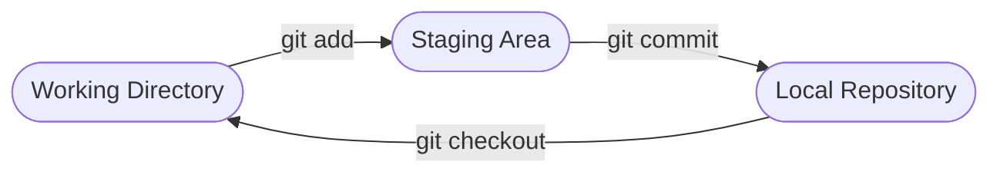

# Aula 04 - Controle de Versão com Git: Fundamentos 🛠️

!!! tip "Objetivo"
    **Objetivo**: Entender o conceito de versionamento distribuído, configurar o Git pela primeira vez e dominar o fluxo básico de salvamento de trabalho (Local Workflow).

---

## 1. O que é o Git? 🧠

O **Git** é um sistema de controle de versão distribuído. Ele funciona como uma "Máquina do Tempo" para o seu código, permitindo que você salve estados do projeto e retorne a eles se algo der errado.

### 🧠 Conceito: Snapshot vs Backup

=== "Backup Comum"
    Ferramentas convencionais (como Google Drive) salvam cópias inteiras do arquivo. Se você apagar tudo e salvar, a versão anterior se perde ou fica difícil de recuperar sem duplicar gigabytes de dados.
    
=== "Git (Snapshots)"
    O Git tira "fotos" incrementais do seu projeto. Ele monitora apenas **o que mudou** (as linhas adicionadas ou removidas). Se não há alteração, o Git apenas aponta para a versão anterior, permitindo navegar por todo o histórico em milissegundos.

---

## 2. Configuração Inicial ⚙️

Antes de começar, o Git precisa saber quem você é. Isso é importante para que cada alteração tenha um autor identificado.

<div class="termy" markdown="1">
<!-- termynal -->
```bash
$ git config --global user.name "Seu Nome"
$ git config --global user.email "seu@email.com"
$ git config --list
user.name=Seu Nome
user.email=seu@email.com
```
</div>

---

## 3. O Fluxo de Trabalho Local 🔄

Para salvar alterações no Git, passamos por três estados principais:

1.  **Working Directory**: Onde você edita seus arquivos.
2.  **Staging Area (Index)**: A "sala de espera". Aqui você escolhe o que será salvo.
3.  **Local Repository**: Onde a "foto" é guardada permanentemente.

### Visualização do Fluxo de Trabalho



---

## 4. Comandos de Sobrevivência ⌨️

Estes são os comandos que você usará 90% do tempo:

| Comando | Ação |
| :--- | :--- |
| `git init` | Transforma a pasta atual em um repositório Git. |
| `git status` | Mostra o que foi alterado e o que está na "sala de espera". |
| `git add .` | Adiciona todas as mudanças para a Staging Area. |
| `git commit -m "mensagem"` | Salva as mudanças com uma descrição. |
| `git log` | Mostra o histórico de todas as fotos (commits). |

---

## 5. Exemplo Prático de Commit 💻

<div class="termy" markdown="1">
<!-- termynal -->
```bash
$ git init
Initialized empty Git repository in /projeto/.git/
$ touch README.md
$ git status
Untracked files: README.md
$ git add README.md
$ git commit -m "Initial commit: adicionar README"
[master (root-commit) 8b1f2] Initial commit
```
</div>

---

## 6. Prática: Minha Primeira Máquina do Tempo 🚀

1.  Crie uma pasta chamada `meu-primeiro-repo`.
2.  Inicie o Git nesta pasta.
3.  Crie um arquivo `historia.txt` e escreva uma frase.
4.  Adicione o arquivo ao Git e faça um commit com a mensagem "Início da história".
5.  Altere o arquivo, adicione outra frase e faça um novo commit "Capítulo 2".
6.  Use o comando `git log` para ver suas duas "fotos" salvas.

---

## 🔗 Materiais da Aula

<div class="grid cards" markdown>
- :material-presentation: **Slides**

    ---

    Material visual com diagramas e conceitos-chave.

    [:octicons-arrow-right-24: Slide 04](../slides/slide-04.html)

- :material-help-circle: **Quiz**

    ---

    Teste seu conhecimento com 10 questões interativas.

    [:octicons-arrow-right-24: Quiz 04](../quizzes/quiz-04.md)

- :fontawesome-solid-pencil: **Exercícios**

    ---

    5 exercícios progressivos (básico → desafio).

    [:octicons-arrow-right-24: Exercício 04](../exercicios/exercicio-04.md)

- :material-briefcase-outline: **Projeto**

    ---

    Aplicação prática dos conceitos da aula.

    [:octicons-arrow-right-24: Projeto 04](../projetos/projeto-04.md)

</div>

---

[➡️ Próxima Aula: Aula 05](./aula-05.md){ .md-button .md-button--primary }
