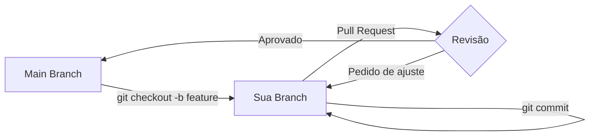

# Aula 05 - Plataformas de Colaboração 🤝

!!! tip "Objetivo"
    **Objetivo**: Entender o papel das plataformas de hospedagem de código, conectar seu repositório local com a nuvem e compreender o fluxo de colaboração via Pull Requests.

---

## 1. Do Local para a Nuvem ☁️

Até agora, trabalhamos apenas na nossa máquina. Para colaborar com outras pessoas e garantir a segurança do nosso código, usamos plataformas como **GitHub**, **GitLab** ou **Bitbucket**.

### 🧠 Conceito: Repositório Remoto (Remote)
Um repositório remoto é uma versão do seu projeto que vive em um servidor. O Git permite que você "empurre" (push) suas fotos locais para lá e "puxe" (pull) as fotos de outros colegas.

---

## 2. GitHub: O Padrão de Mercado 🐙

O GitHub é a maior plataforma de desenvolvedores do mundo. Além de hospedar o código, ele oferece ferramentas sociais e de automação.

### Comandos de Conexão

| Comando | Ação |
| :--- | :--- |
| `git remote add origin <URL>` | Conecta seu repo local a um link remoto. |
| `git push -u origin main` | Envia seus commits para o servidor pela primeira vez. |
| `git pull origin main` | Traz as novidades do servidor para sua máquina. |
| `git clone <URL>` | Baixa um projeto completo da internet. |

---

## 3. O Fluxo de Colaboração Profissional 🔄

Em equipes profissionais, ninguém mexe direto no código "oficial" (main). Usamos um fluxo chamado **GitHub Flow**:

1.  **Branch**: Você cria uma "cópia" segura para trabalhar.
2.  **Commit**: Faz suas alterações.
3.  **Pull Request (PR)**: Você pede permissão para unir suas mudanças ao código oficial.
4.  **Code Review**: Outros devs revisam seu código e sugerem melhorias.
5.  **Merge**: Se tudo estiver ok, o código é unido.

### Visualização do Fluxo de PR (Mermaid)



---

## 4. Praticando a Sincronização 💻

```termynal
$ git remote add origin https://github.com/usuario/meu-projeto.git
$ git push -u origin main
Enumerating objects: 3, done.
Counting objects: 100% (3/3), done.
Writing objects: 100% (3/3), 220 bytes | 220.00 KiB/s, done.
To https://github.com/usuario/meu-projeto.git
 * [new branch]      main -> main
```

---

## 5. Mini-Projeto: Meu Portfólio no Ar 🚀

Sua missão é subir um de seus códigos para o GitHub:

1.  Crie um novo repositório **Público** no GitHub chamado `ads-ferramentas-desafio`.
2.  No seu terminal, dentro de uma pasta com código, execute o comando para adicionar o `origin`.
3.  Faça o `push` do seu código.
4.  Verifique no navegador se os arquivos apareceram lá.
5.  **Desafio**: Peça para um colega (ou use outra conta) fazer um "Fork" do seu projeto.

---

## 6. Exercício de Fixação 📝

1.  **Básico**: Qual a principal diferença entre o Git (software) e o GitHub (plataforma)?
2.  **Básico**: Para que serve o comando `git clone`?
3.  **Intermediário**: Por que o **Code Review** é uma etapa fundamental em grandes empresas de tecnologia?
4.  **Intermediário**: Explique o que acontece se duas pessoas alterarem a mesma linha de código e tentarem enviar para o GitHub.
5.  **Desafio**: Pesquise o que é um "Fork" e em qual situação ele é mais utilizado do que uma "Branch".

---

**Próxima Aula**: Vamos falar sobre onde os dados moram: [Bancos de Dados Relacionais e Clientes GUI](./aula-06.md)! 💾
