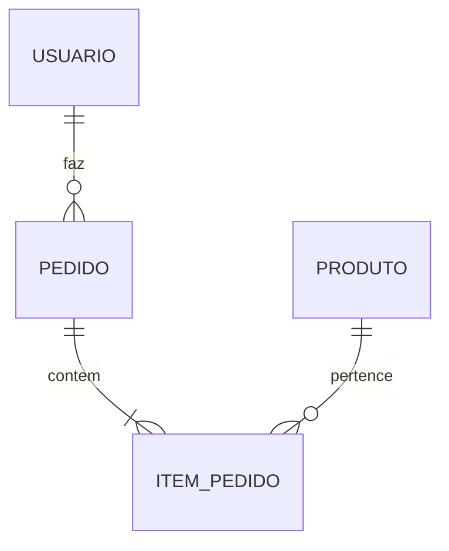

# Aula 06 - Bancos de Dados Relacionais e Clientes GUI 💾

!!! tip "Objetivo"
    **Objetivo**: Compreender o modelo de dados relacional (SQL), conhecer os principais bancos de dados do mercado e dominar o uso de ferramentas visuais para manipulação de dados.

---

## 1. Onde os Dados Moram? 🏗️

Quase toda aplicação precisa salvar informações permanentemente (usuários, pedidos, produtos). Para isso, usamos **Sistemas de Gerenciamento de Banco de Dados (SGBDs)**.

### 🧩 Modelo Relacional (SQL)

=== "Tabelas Rígidas"
    O modelo SQL usa estruturação forte, em que cada coluna representa um atributo muito claro e inquebrável (Ex: ID, Nome, Email). Para organizar isso e mitigar a redundância de dados, divide-se em múltiplas tabelas que se "relacionam".
    
=== "Escopo"
    No exemplo abaixo, as informações estão na Tabela `Usuarios`. Se este usuário realiza compras, não reescrevemos o nome/email na venda, mas guardamos uma referência apontando para o seu `ID`.

| Exemplo de Tabela: `Usuarios` |
| :--- | :--- | :--- |
| **ID** | **Nome** | **Email** |
| 1 | Ana Silva | ana@email.com |
| 2 | Bob Souza | bob@email.com |

---

## 2. Líderes de Mercado 🏆

### 🐘 PostgreSQL
O "queridinho" dos desenvolvedores modernos. É robusto, gratuito e extremamente poderoso para lidar com grandes volumes de dados complexos.

### 🐬 MySQL
Famoso por ser o motor de grandes plataformas como o WordPress. É rápido e possui uma comunidade gigantesca.

---

## 3. Clientes GUI: Adeus Linha de Comando! 🖥️

Embora você possa usar o terminal, ferramentas visuais (Graphical User Interface) facilitam muito a vida do desenvolvedor.

### 🐝 DBeaver
O "canivete suíço" dos bancos de dados. É uma ferramenta universal que se conecta a quase qualquer banco (SQL, NoSQL, Nuvem).
*   **Vantagem**: Você aprende uma interface e usa em todos os projetos.

### 🎨 Beekeeper Studio
Uma alternativa moderna, mais bonita e simples de usar, ideal para quem está começando.

---

## 4. Visualizando Estruturas



---

## 5. Praticando com SQL no Terminal 💻

Mesmo com ferramentas visuais, é bom conhecer o básico:

<div class="termy" markdown="1">
```termynal
$ psql -U postgres -d meu_banco
psql (15.3)
Type "help" for help.
meu_banco=# SELECT * FROM usuarios WHERE id = 1;
 id |   nome    |     email
----+-----------+---------------
  1 | Ana Silva | ana@email.com
(1 row)
```
</div>

---

## 6. Prática: Conectando os Pontos 🚀

Sua missão é explorar um banco de dados real usando uma ferramenta visual:

1.  Instale o **DBeaver** Community Edition em sua máquina.
2.  Crie uma nova conexão do tipo **SQLite** (um banco que é apenas um arquivo, sem precisar instalar servidor).
3.  Crie uma tabela chamada `Ferramentas` com as colunas: `ID`, `Nome` e `Categoria`.
4.  Insira 3 linhas de dados usando a interface visual do DBeaver.
5.  Execute uma consulta SQL: `SELECT * FROM Ferramentas;` e veja o resultado.

---

## 📝 Prática Sugerida

Para consolidar o conhecimento desta aula, realize os exercícios propostos:

👉 **[Ver Exercícios da Aula 06](../exercicios/exercicio-06.md)**
👉 **[Ver Projeto da Aula 06](../projetos/projeto-06.md)**

---

**Próxima Aula**: Vamos conhecer a velocidade do [Módulo 2 - Aula 07 - NoSQL e Cache (MongoDB/Redis)](./aula-07.md)! ⚡

