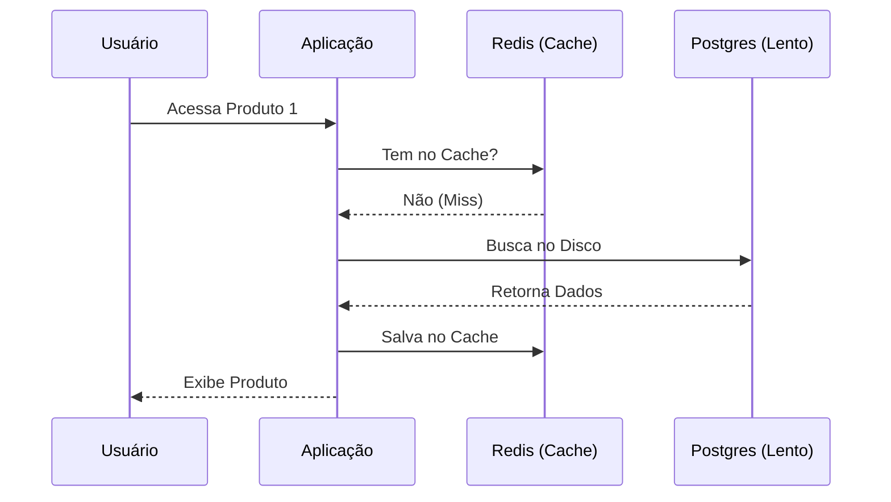

# Aula 07 - Bancos de Dados NoSQL e Cache ⚡

!!! tip "Objetivo"
    **Objetivo**: Entender quando utilizar bancos de dados não relacionais (NoSQL), compreender o conceito de documentos e descobrir como o Cache (Redis) acelera aplicações de larga escala.

---

## 1. Além das Tabelas: O Mundo NoSQL 🧠

Nem todo dado se encaixa bem em linhas e colunas rígidas. Para dados flexíveis e que precisam escalar rapidamente, usamos o **NoSQL (Not Only SQL)**.

### 📄 Orientado a Documentos (MongoDB)

=== "A Estrutura"
    Em vez de tabelas rigorosas, usamos **Coleções**, que armazenam **Documentos**. Esses documentos se assemelham a objetos JSON na estrutura de chave-valor.
    
=== "Escalonamento"
    Ao dispensar "joins" complexos e predefinir que um mesmo Produto A pode ter especificações ausentes no Produto B, o MongoDB facilita muito o **sharding** — ou seja, espalhar os dados horizontalmente por dezenas de discos diferentes.

---

## 2. NoSQL vs SQL: Qual Usar? ⚖️

| Característica | 💾 SQL (Relacional) | ⚡ NoSQL (Documentos) |
| :--- | :--- | :--- |
| **Esquema** | Rígido (Fixo) | Flexível (Dinâmico) |
| **Relacionamentos** | Complexos (Joins) | Simples (Embarcados) |
| **Foco** | Consistência e Precisão | Velocidade e Escala |
| **Exemplos** | Postgres, MySQL | MongoDB, Cassandra |

---

## 3. Redis: A Velocidade da Memória 🚀

O **Redis** é um banco de dados que vive na **Memória RAM**, e não no disco rígido. Isso o torna incrivelmente rápido (milissegundos!).

### 🧠 Conceito: Cache
Imagine que um site de notícias tem 1 milhão de acessos na mesma matéria. Em vez de perguntar para o banco de dados lento 1 milhão de vezes, salvamos a resposta no **Redis** (Cache) por alguns minutos.

### Fluxo de Funcionamento do Cache



---

## 4. Praticando com Redis no Terminal 💻

<div class="termy" markdown="1">
<!-- termynal -->
```bash
$ redis-cli
127.0.0.1:6379> SET saudacao "Olá Mundo"
OK
127.0.0.1:6379> GET saudacao
"Olá Mundo"
127.0.0.1:6379> EXPIRE saudacao 10
(integer) 1
# (Apaga o dado automaticamente em 10 segundos)
```
</div>

---

## 5. Prática: Explorando um JSON 🚀

No NoSQL, a estrutura mais comum é o **JSON**. Sua missão é criar o "esquema" de um documento para um sistema de cursos:

1.  Abra seu VS Code.
2.  Crie um arquivo chamado `aula.json`.
3.  Descreva uma aula utilizando a estrutura JSON (campos como nome, duracao, lista de ferramentas).
4.  Certifique-se de que o JSON esteja válido (use um validador online se necessário).

---

## 🔗 Materiais da Aula

<div class="grid cards" markdown>
- :material-presentation: **Slides**

    ---

    Material visual com diagramas e conceitos-chave.

    [:octicons-arrow-right-24: Slide 07](../slides/slide-07.html)

- :material-help-circle: **Quiz**

    ---

    Teste seu conhecimento com 10 questões interativas.

    [:octicons-arrow-right-24: Quiz 07](../quizzes/quiz-07.md)

- :fontawesome-solid-pencil: **Exercícios**

    ---

    5 exercícios progressivos (básico → desafio).

    [:octicons-arrow-right-24: Exercício 07](../exercicios/exercicio-07.md)

- :material-briefcase-outline: **Projeto**

    ---

    Aplicação prática dos conceitos da aula.

    [:octicons-arrow-right-24: Projeto 07](../projetos/projeto-07.md)

</div>

---

[➡️ Próxima Aula: Aula 08](./aula-08.md){ .md-button .md-button--primary }
