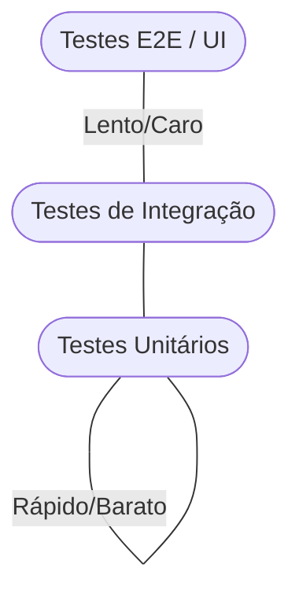

# Aula 08 - Frameworks de Teste e Qualidade 🧪

!!! tip "Objetivo"
    **Objetivo**: Entender a importância dos testes automatizados para a estabilidade do software, conhecer os diferentes níveis de teste e descobrir os principais frameworks de cada linguagem.

---

## 1. Por que Testar? 🛡️

Software sem testes é uma bomba relógio. À medida que o código cresce, mudar uma linha pode quebrar algo que já estava funcionando.

### 🧠 Conceito: Regressão

=== "Riscos"
    Na engenharia, um pequeno *hotfix* numa função utilitária pode desencadear uma reação em cadeia oculta. Se os desenvolvedores precisarem testar a tela toda a vez que o código muda, perde-se eficiência e confiabilidade.
    
=== "A Rede de Proteção"
    Testes automatizados evitam a **regressão**. Eles processam as regras de negócio em frações de segundos garantindo que um módulo continue retornando o que você esperava antes de aprovar uma mudança nova.

---

## 2. Níveis de Teste: A Pirâmide 🏗️

Nem todos os testes são iguais. Os desenvolvedores seguem a **Pirâmide de Testes**:

1.  **Testes Unitários (Base)**: Testam pequenas partes isoladas (funções ou classes). São rápidos e baratos.
2.  **Testes de Integração (Meio)**: Testam se dois ou mais módulos funcionam bem juntos (ex: API salvando no Banco).
3.  **Testes E2E - Ponta a Ponta (Topo)**: Simulam o usuário real clicando na tela. São lentos e complexos.

### Pirâmide de Testes



---

## 3. Ferramentas por Linguagem 🏆

Cada ecossistema tem seu framework de "ouro":

| Linguagem | Framework de Teste |
| :--- | :--- |
| **JavaScript/TS** | **Jest** / Vitest |
| **Python** | **PyTest** |
| **Java** | **JUnit** |
| **C# (.NET)** | **xUnit** / NUnit |

---

## 4. O Ciclo TDD (Test Driven Development) 🔄

Alguns desenvolvedores preferem escrever o teste **antes** do código. Este processo é chamado de TDD:

1.  🔴 **Red**: Escreve um teste que falha.
2.  🟢 **Green**: Escreve o código mínimo para o teste passar.
3.  🔵 **Refactor**: Melhora o código garantindo que o teste ainda passe.

---

## 5. Praticando no Terminal 💻

Simulando a execução de um teste com o Jest:

<div class="termy" markdown="1">
```termynal
$ npm test
> jest

 PASS  ./soma.test.js
  ✓ soma 1 + 2 deve ser 3 (5 ms)
  ✓ soma -1 + 5 deve ser 4 (2 ms)

Test Suites: 1 passed, 1 total
Tests:       2 passed, 2 total
Snapshots:   0 total
Time:        1.2 s
Ran all test suites.
```
</div>

---

## 6. Prática: O Primeiro Teste (Lógica) 🚀

Mesmo que ainda não estejamos codificando, vamos pensar na lógica de um teste unitário:

1.  Imagine uma função chamada `calcularDesconto(preco, percentual)`.
2.  No seu bloco de notas, escreva 3 cenários de teste:
    *   **Cenário 1**: Preço 100, Desconto 10. Resultado esperado: 90.
    *   **Cenário 2**: Preço 50, Desconto 0. Resultado esperado: 50.
    *   **Cenário 3**: Preço 200, Desconto 100. Resultado esperado: 0.

---

## 📝 Prática Sugerida

Para consolidar o conhecimento desta aula, realize os exercícios propostos:

👉 **[Ver Exercícios da Aula 08](../exercicios/exercicio-08.md)**
👉 **[Ver Projeto da Aula 08](../projetos/projeto-08.md)**

---

**Próxima Aula**: Vamos testar a comunicação entre sistemas com as [Módulo 3 - Aula 09 - Ferramentas de API (Postman/Insomnia)](./aula-09.md)! 📡

