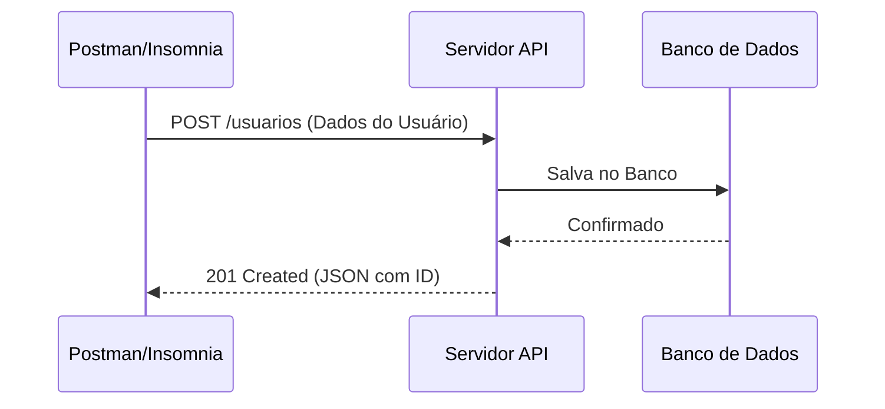

# Aula 09 - Ferramentas de API (Postman / Insomnia) 📡

!!! tip "Objetivo"
    **Objetivo**: Dominar o uso de clients HTTP para testar e documentar APIs, entender os métodos HTTP e interpretar os principais códigos de status retornados pelo servidor.

---

## 1. O que são Clients de API? 🕵️‍♂️

Quando desenvolvemos o backend (o "servidor"), muitas vezes ainda não temos o frontend (a "tela"). Para testar se o servidor está respondendo corretamente, usamos ferramentas que simulam requisições de um navegador ou aplicativo.

### 🏆 Líderes de Mercado

=== "Postman"
    A plataforma mais consolidada no mercado. É ideal para APIs maduras que necessitam de *Workspaces* compartilhados, *Mocks* e automação completa de coleções (com relatórios).
    
=== "Insomnia"
    Foca no minimalismo, velocidade e segurança local. Por não sobrecarregar as abas com dezenas de *features*, é a escolha preferida de novos devs e projetos ágeis.

---

## 2. O Protocolo HTTP na Prática 🔄

Para conversar com uma API, precisamos seguir as regras do protocolo HTTP.

### Métodos (Verbos) HTTP
1.  **GET**: Buscar informações (ex: listar produtos).
2.  **POST**: Criar algo novo (ex: cadastrar usuário).
3.  **PUT**: Atualizar algo existente (ex: mudar senha).
4.  **DELETE**: Remover algo (ex: excluir conta).

### Status Codes (Retorno do Servidor)
*   **200 OK**: Deu tudo certo!
*   **201 Created**: Criado com sucesso.
*   **400 Bad Request**: Você enviou algo errado.
*   **401 Unauthorized**: Você não está logado.
*   **404 Not Found**: Não encontrei o que você pediu.
*   **500 Internal Server Error**: O servidor "quebrou" (erro do programador).

---

## 3. Fluxo de uma Requisição (Mermaid)



---

## 4. Praticando no Terminal 💻

Embora o Postman seja visual, as APIs também podem ser testadas via terminal usando o comando `curl`:

<div class="termy" markdown="1">
```termynal
$ curl -X GET https://jsonplaceholder.typicode.com/users/1
{
  "id": 1,
  "name": "Leanne Graham",
  "username": "Bret",
  "email": "Sincere@april.biz"
}
```
</div>

---

## 5. Mini-Projeto: Minha Primeira Collection 🚀

Sua missão é testar uma API pública e organizar os resultados:

1.  Baixe e instale o **Postman** ou o **Insomnia**.
2.  Crie uma nova **Collection** chamada "Teste Local".
3.  Crie uma requisição **GET** para: `https://jsonplaceholder.typicode.com/posts`.
4.  Verifique o Status Code. Foi 200?
5.  **Desafio**: Tente fazer um **POST** para a mesma URL enviando um JSON com `title` e `body`.

---

## 6. Exercício de Fixação 📝

1.  **Básico**: Qual a vantagem de usar o Postman em vez de apenas o navegador para testar uma API?
2.  **Básico**: O que significa um erro da família **4xx** (ex: 404)?
3.  **Intermediário**: Em qual situação usaríamos o método **PUT** em vez de **POST**?
4.  **Intermediário**: O que é o "Body" de uma requisição e em quais métodos ele é mais comum?
5.  **Desafio**: Pesquise o que é uma **Variável de Ambiente** no Postman e por que ela é útil para alternar entre "Ambiente de Teste" e "Ambiente de Produção".

---

**Próxima Aula**: Vamos deixar nosso código impecável com os [Linters e Formatadores (ESLint/Prettier)](./aula-10.md)! ✨
