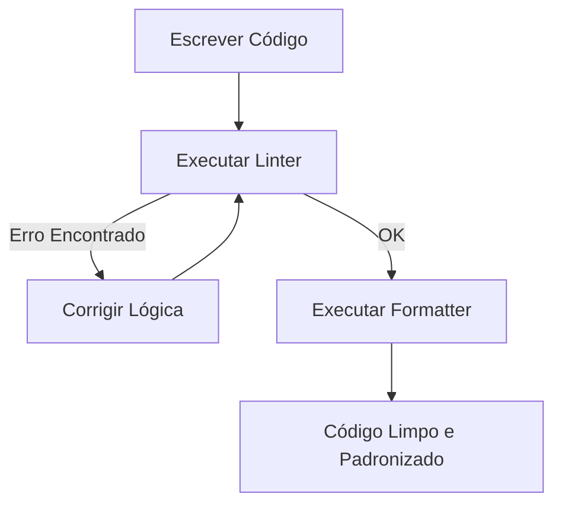

# Aula 10 - Qualidade de Código (Linters e Formatters) ✨

!!! tip "Objetivo"
    **Objetivo**: Entender como as ferramentas de análise estática garantem a padronização do código em equipe, evitando erros comuns e mantendo um estilo visual consistente.

---

## 1. O Código Além do Funcionamento 🧠

Não basta o código "funcionar". Para que um projeto dure anos e seja mantido por várias pessoas, ele precisa ser legível e seguir padrões.

### 🧩 Análise Estática
É o processo de ler o código sem executá-lo para encontrar problemas. Ferramentas de análise estática são como "corretores ortográficos" para programadores.

---

## 2. Linters vs Formatters: Qual a Diferença? ⚖️

Embora parecidos, eles resolvem problemas diferentes:

| Ferramenta | O que faz? | Exemplo |
| :--- | :--- | :--- |
| **Linter** (ESLint / Flake8) | Encontra **erros de lógica** e potenciais bugs. | Variável criada mas nunca utilizada. |
| **Formatter** (Prettier / Black) | Cuida do **visual** e do estilo do código. | Colocar ponto e vírgula, ajustar espaços. |

### 🛠️ Por que usar os dois?
O Formatter deixa o código bonito; o Linter garante que ele está correto e segue as boas práticas da linguagem.

---

## 3. O Fluxo de Correção (Mermaid)



---

## 4. Praticando no Terminal 💻

Simulando o uso do ESLint para encontrar erros e do Prettier para formatar:

```termynal
$ npx eslint index.js
# index.js
#   5:12  error  'total' is assigned a value but never used (no-unused-vars)

$ npx prettier --write index.js
index.js 220ms (formatted)
```

---

## 5. Mini-Projeto: Configurando o Corretor Automático 🚀

Sua missão é ver a mágica da formatação automática no VS Code:

1.  Abra o VS Code e instale a extensão **Prettier - Code Formatter**.
2.  Vá em **Settings** (Ctrl + ,) e pesquise por `Format on Save`. Ative essa opção.
3.  Crie um arquivo chamado `bagunca.js`.
4.  Escreva um código propositalmente bagunçado (muitos espaços, aspas simples e duplas misturadas, sem identação).
5.  **Salve o arquivo** e observe o VS Code organizar tudo instantaneamente.

---

## 6. Exercício de Fixação 📝

1.  **Básico**: Qual a vantagem de uma equipe inteira usar o mesmo arquivo de configuração do Prettier?
2.  **Básico**: O que um Linter faz que um Formatter não consegue fazer?
3.  **Intermediário**: Por que dizemos que o Linter ajuda a evitar "bugs silenciosos"?
4.  **Intermediário**: Explique o conceito de "Clean Code" e como essas ferramentas ajudam a atingi-lo.
5.  **Desafio**: Pesquise o que é o arquivo `.eslintrc` e para que serve a seção `rules`.

---

**Próxima Aula**: Vamos automatizar tudo com o [CI/CD Moderno (GitHub Actions)](./aula-11.md)! 🚀
