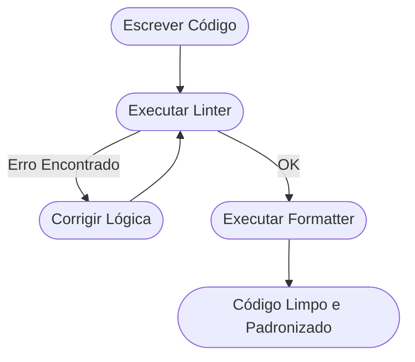

# Aula 10 - Qualidade de Código (Linters e Formatters) ✨

!!! tip "Objetivo"
    **Objetivo**: Entender como as ferramentas de análise estática garantem a padronização do código em equipe, evitando erros comuns e mantendo um estilo visual consistente.

---

## 1. O Código Além do Funcionamento 🧠

Não basta o código "funcionar". Para que um projeto dure anos e seja mantido por várias pessoas, ele precisa ser legível e seguir padrões.

### 🧩 Análise Estática

=== "Prevenção"
    Ferramentas de análise estática são o primeiro filtro de qualidade de um time. Elas leem seu código antes mesmo de você tentar rodá-lo (sem executá-lo), detectando anomalias e *code smells* (códigos mal estruturados).
    
=== "A Regra de Ouro"
    As regras são configuráveis. O time decide que "Toda função deve ter limite de 20 linhas" ou "Ninguém pode usar aspas duplas". O *Linter* se torna o policial automático que barra códigos fora do padrão no GitHub.

---

## 2. Linters vs Formatters: Qual a Diferença? ⚖️

Embora parecidos, eles resolvem problemas diferentes:

| Ferramenta | O que faz? | Exemplo |
| :--- | :--- | :--- |
| **Linter** (ESLint / Flake8) | Encontra **erros de lógica** e potenciais bugs. | Variável criada mas nunca utilizada. |
| **Formatter** (Prettier / Black) | Cuida do **visual** e do estilo do código. | Colocar ponto e vírgula, ajustar espaços. |

### 🛠️ Por que usar os dois?
O Formatter deixa o código bonito; o Linter garante que ele está correto e segue as boas práticas da linguagem.

---

## 3. O Fluxo de Correção de Código



---

## 4. Praticando no Terminal 💻

Simulando o uso do ESLint para encontrar erros e do Prettier para formatar:

<div class="termy" markdown="1">
<!-- termynal -->
```bash
$ npx eslint index.js
# index.js
#   5:12  error  'total' is assigned a value but never used (no-unused-vars)

$ npx prettier --write index.js
index.js 220ms (formatted)
```
</div>

---

## 5. Prática: Configurando o Corretor Automático 🚀

Sua missão é ver a mágica da formatação automática no VS Code:

1.  Abra o VS Code e instale a extensão **Prettier - Code Formatter**.
2.  Vá em **Settings** (Ctrl + ,) e pesquise por `Format on Save`. Ative essa opção.
3.  Crie um arquivo chamado `bagunca.js`.
4.  Escreva um código propositalmente bagunçado (muitos espaços, aspas simples e duplas misturadas, sem identação).
5.  **Salve o arquivo** e observe o VS Code organizar tudo instantaneamente.

---

## 🔗 Materiais da Aula

<div class="grid cards" markdown>
- :material-presentation: **Slides**

    ---

    Material visual com diagramas e conceitos-chave.

    [:octicons-arrow-right-24: Slide 10](../slides/slide-10.html)

- :material-help-circle: **Quiz**

    ---

    Teste seu conhecimento com 10 questões interativas.

    [:octicons-arrow-right-24: Quiz 10](../quizzes/quiz-10.md)

- :fontawesome-solid-pencil: **Exercícios**

    ---

    5 exercícios progressivos (básico → desafio).

    [:octicons-arrow-right-24: Exercício 10](../exercicios/exercicio-10.md)

- :material-briefcase-outline: **Projeto**

    ---

    Aplicação prática dos conceitos da aula.

    [:octicons-arrow-right-24: Projeto 10](../projetos/projeto-10.md)

</div>

---

[➡️ Próxima Aula: Aula 11](./aula-11.md){ .md-button .md-button--primary }
