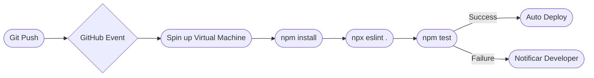

# Aula 11 - CI/CD Moderno (GitHub Actions) 🚀

!!! tip "Objetivo"
    **Objetivo**: Compreender o ciclo de integração e entrega contínua (CI/CD), aprender a criar workflows automatizados no GitHub e garantir que o código seja testado automaticamente a cada push.

---

## 1. O que é CI/CD? 🔄

Em vez de rodar testes e linters manualmente na sua máquina local, a nuvem assume a responsabilidade após cada interação no controle de versão.

=== "CI (Integração Contínua)"
    Integrar e validar o código de dezenas de desenvolvedores repetidas vezes ao dia. O servidor "puxa" o código, roda os linters, compila (build) e dispara centenas de testes unitários. Se algo quebrar, o pull request é bloqueado.
    
=== "CD (Entrega/Deploy Contínuo)"
    Uma vez que os testes garantem que o software está estável (CI passou), o processo de CD empacota esse aplicativo e o instale automaticamente nos servidores hospedados de teste ou de produção, sem intervenção humana.

---

## 2. GitHub Actions: Automação na Nuvem 🤖

O GitHub Actions é a ferramenta de CI/CD integrada ao GitHub. Ele funciona através de arquivos de configuração no formato **YAML**.

### Componentes do Actions:
1.  **Workflow**: O processo completo (ex: "Build e Teste").
2.  **Event**: O que dispara o processo (ex: um `push` ou um `pull_request`).
3.  **Job**: Uma tarefa específica dentro do workflow (ex: "rodar testes unitários").
4.  **Steps**: Os comandos passo a passo dentro de um Job.

---

## 3. Visualização da Pipeline



---

## 4. O Arquivo de Configuração (.yml) 📄

Abaixo, um exemplo de como é um arquivo de workflow real:

```yaml
name: Node.js CI
on: [push]
jobs:
  build:
    runs-on: ubuntu-latest
    steps:
      - uses: actions/checkout@v3
      - name: Install dependencies
        run: npm install
      - name: Run tests
        run: npm test
```

---

## 5. Praticando no Terminal (Simulação) 💻

Imagine o terminal do servidor do GitHub executando seu workflow:

<div class="termy" markdown="1">
```termynal
$ runner-ci --start
Starting Workflow: Node.js CI
Step 1: Checking out code... OK
Step 2: Installing Node 18... OK
Step 3: Running npm install... OK
Step 4: Running npm test... 
 PASS  test/auth.test.js
 PASS  test/db.test.js
Step 5: All tests passed! Pipeline completed.
```
</div>

---

## 6. Prática: Monitorando um Workflow 🚀

1.  Vá até um repositório seu no GitHub.
2.  Clique na aba **Actions**.
3.  O GitHub sugerirá "Workflows" baseados na sua linguagem.
4.  Escolha um simples (como Node.js ou Python) e clique em **Set up this workflow**.
5.  Clique em **Commit changes**.
6.  Veja o workflow rodar em tempo real e verifique se ele fica "Verde" (Sucesso).

---

## 📝 Prática Sugerida

Para consolidar o conhecimento desta aula, realize os exercícios propostos:

👉 **[Ver Exercícios da Aula 11](../exercicios/exercicio-11.md)**
👉 **[Ver Projeto da Aula 11](../projetos/projeto-11.md)**

---

**Próxima Aula**: Vamos falar de infraestrutura com [Módulo 3 - Aula 12 - Automação e IaC (Ansible/Terraform)](./aula-12.md)! ⚙️
