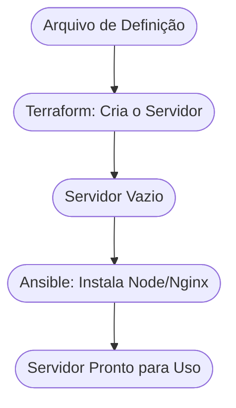

# Aula 12 - Automação e IaC (Ansible e Terraform) ⚙️

!!! tip "Objetivo"
    **Objetivo**: Entender o conceito de Infraestrutura como Código (IaC), descobrir como o Terraform cria recursos na nuvem e como o Ansible gerencia e configura servidores automaticamente.

---

## 1. O Problema da Configuração Manual 😫

No passado, para criar um servidor, um técnico precisava configurar tudo manualmente: instalar o Linux, o banco de dados, as senhas, etc. Se precisasse de 10 servidores, ele repetia o processo 10 vezes.

### 🧠 Conceito: Infraestrutura como Código (IaC)

=== "Manual vs Automatizado"
    O provisionamento manual envolve dezenas de cliques em painéis como AWS ou Azure. Quando a empresa cresce e precisa de 100 servidores idênticos, a chance de erro humano (configuração esquecida, porta aberta, versão errada) beira os 100%.

=== "Reprodutibilidade"
    Com **IaC**, a infraestrutura vira um script de texto versionado no Git. Se um servidor queimar, basta apertar "Run" novamente e um gêmeo idêntico subirá em minutos. Do mesmo modo, se um desenvolvedor injetar uma falha na infra, o time poderá simplesmente revogar (reverter) o *commit* no código de infraestrutura.

---

## 2. Terraform: O Arquiteto da Nuvem 🏗️

O **Terraform** serve para **provisionar** a infraestrutura. Ele "telefona" para a AWS, Google Cloud ou Azure e diz: "Crie para mim 3 servidores e 1 banco de dados".

*   **Linguagem**: HCL (HashiCorp Configuration Language).
*   **Estado (State)**: O Terraform lembra o que ele criou, para que ele possa atualizar ou destruir depois sem se perder.

---

## 3. Ansible: O Mestre de Obras 👷‍♂️

Enquanto o Terraform "constrói o prédio" (servidor), o **Ansible** entra para "pintar as paredes e instalar os móveis" (configurar o software).

*   **Sem Agente**: O Ansible não precisa ser instalado no servidor destino, ele usa apenas o acesso SSH.
*   **Playbooks**: Arquivos YAML que descrevem o que deve ser instalado e configurado.

### Fluxo Combinado (Mermaid)



---

## 4. O Arquivo Ansible (Exemplo) 📄

Mesmo sem rodar, veja como é simples descrever uma instalação de servidor:

<div class="termy" markdown="1">
```termynal
$ ansible-playbook playbook.yml
```
</div>

```yaml
---
- name: Instalar Nginx no Servidor Web
  hosts: webservers
  tasks:
    - name: Garantir que o Nginx esteja instalado
      apt:
        name: nginx
        state: present
    - name: Iniciar o serviço do Nginx
      service:
        name: nginx
        state: started
```

---

## 5. Praticando a Lógica de Automação 🚀

1.  Imagine que você tem 50 computadores em um laboratório.
2.  Todos precisam ter o **Google Chrome** e o **VS Code** instalados hoje.
3.  No seu bloco de notas, escreva a sequência de passos que o Ansible faria:
    *   **Passo 1**: Baixar instalador do Chrome.
    *   **Passo 2**: Executar arquivo de instalação do Chrome.
    *   **Passo 3**: Baixar instalador do VS Code...
4.  Perceba que, com o Ansible, você escreveria isso uma única vez e o comando rodaria nos 50 PCs simultaneamente.

---

## 6. Exercício de Fixação 📝

1.  **Básico**: O que significa o termo "Infraestrutura como Código"?
2.  **Básico**: Qual a diferença principal entre o que o Terraform faz e o que o Ansible faz?
3.  **Intermediário**: Por que é mais seguro usar o Terraform do que criar servidores clicando em botões no painel da AWS?
4.  **Intermediário**: Explique o que é "Idempotência" (pesquise este termo no contexto de Ansible).
5.  **Desafio**: Pesquise o que é "Cloud agnosticism" e por que o Terraform é considerado uma ferramenta que ajuda com isso.

---

**Próxima Aula**: Vamos empacotar tudo com os [Contêineres e Docker](./aula-13.md)! 📦
