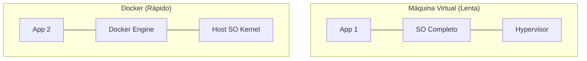

# Aula 13 - Contêineres com Docker 📦

!!! tip "Objetivo"
    **Objetivo**: Compreender o conceito de conteinerização, aprender a criar imagens Docker e orquestrar múltiplos serviços usando o Docker Compose.

---

## 1. O Problema: "Na minha máquina funciona!" 🤷‍♂️

Este é o pesadelo de todo desenvolvedor. Um código que funciona no seu computador, mas quebra quando vai para o servidor porque a versão do banco de dados ou do Node.js é diferente.

### 🧠 Conceito: Contêineres
Um contêiner é uma unidade padrão de software que empacota o código e todas as suas dependências para que a aplicação seja executada de forma rápida e confiável em qualquer ambiente.

---

## 2. Docker: A Baleia Azul 🐳

O **Docker** é a plataforma líder mundial em contêineres.

*   **Imagem**: É o "molde" ou a "receita". Contém tudo o que é necessário para rodar o app (SO, bibliotecas, código).
*   **Contêiner**: É a instância da imagem em execução (o "bolo" pronto).

### Diferença para Máquinas Virtuais (Mermaid)



---

## 3. Docker Compose: Multi-Serviços 🎼

Raramente um app vive sozinho. Ele precisa de um Banco de Dados, um Cache e uma API. O **Docker Compose** permite subir todos eles com um único comando.

```yaml
version: '3'
services:
  web:
    build: .
    ports:
      - "3000:3000"
  db:
    image: postgres:15
    environment:
      POSTGRES_PASSWORD: root
```

---

## 4. Praticando no Terminal 💻

```termynal
$ docker build -t meu-app .
# (Cria a imagem a partir do Dockerfile)
$ docker run -p 8080:80 meu-app
# (Roda o contêiner mapeando a porta 8080)
$ docker ps
CONTAINER ID   IMAGE      STATUS          PORTS
a1b2c3d4e5f6   meu-app    Up 5 minutes    0.0.0.0:8080->80/tcp
```

---

## 5. Mini-Projeto: Meu Primeiro Dockerfile 🚀

Vamos criar a "receita" de um servidor simples:

1.  No VS Code, crie um arquivo chamado `Dockerfile` (sem extensão).
2.  Escreva a lógica básica:
    ```dockerfile
    FROM node:18
    WORKDIR /app
    COPY . .
    RUN npm install
    CMD ["npm", "start"]
    ```
3.  Pense neste arquivo como um conjunto de instruções para o Docker criar sua máquina virtual leve.

---

## 6. Exercício de Fixação 📝

1.  **Básico**: Qual a principal diferença entre uma Imagem e um Contêiner no Docker?
2.  **Básico**: Por que usar o Docker resolve o problema do "na minha máquina funciona"?
3.  **Intermediário**: Para que serve o comando `docker-compose up`?
4.  **Intermediário**: Explique o que é o "Docker Hub".
5.  **Desafio**: Pesquise sobre o conceito de "Camadas" (Layers) em uma imagem do Docker e como isso ajuda na velocidade de build.

---

**Próxima Aula**: Vamos escalar nossos contêineres com o [Kubernetes e Runners](./aula-14.md)! ☸️