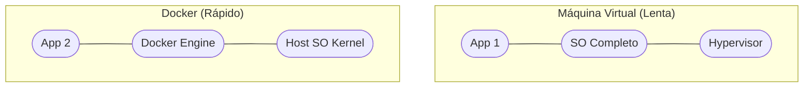

# Aula 13 - Contêineres com Docker 📦

!!! tip "Objetivo"
    **Objetivo**: Compreender o conceito de conteinerização, aprender a criar imagens Docker e orquestrar múltiplos serviços usando o Docker Compose.

---

## 1. O Problema: "Na minha máquina funciona!" 🤷‍♂️

Este é o pesadelo de todo desenvolvedor. Um código que funciona no seu computador, mas quebra quando vai para o servidor porque a versão do banco de dados ou do Node.js é diferente.

### 🧠 Conceito: Contêineres

=== "Virtualização Clássica"
    Antigamente, para isolar um sistema, criava-se uma Máquina Virtual (VM) pesada, com seu próprio Sistema Operacional completo (Linux/Windows), sugando dezenas de Gigabytes e minutos de RAM apenas para ligar.
    
=== "A Era dos Contêineres"
    Contêineres empacotam apenas o código e bibliotecas essenciais, compartilhando de forma inteligente o "kernel" do sistema operacional hospedeiro. Isso garante inicialização instantânea e economia brutal de recursos.

---

## 2. Docker: A Baleia Azul 🐳

O **Docker** é a plataforma líder mundial em contêineres.

*   **Imagem**: É o "molde" ou a "receita". Contém tudo o que é necessário para rodar o app (SO, bibliotecas, código).
*   **Contêiner**: É a instância da imagem em execução (o "bolo" pronto).

### Diferença para Máquinas Virtuais



---

## 3. Docker Compose: Multi-Serviços 🎼

Raramente um app vive sozinho. Ele precisa de um Banco de Dados, um Cache e uma API. O **Docker Compose** permite subir todos eles com um único comando.

```yaml
version: '3'
services:
  web:
    build: .
    ports:
      - "3000:3000"
  db:
    image: postgres:15
    environment:
      POSTGRES_PASSWORD: root
```

---

## 4. Praticando no Terminal 💻

<div class="termy" markdown="1">
<!-- termynal -->
```bash
$ docker build -t meu-app .
# (Cria a imagem a partir do Dockerfile)
$ docker run -p 8080:80 meu-app
# (Roda o contêiner mapeando a porta 8080)
$ docker ps
CONTAINER ID   IMAGE      STATUS          PORTS
a1b2c3d4e5f6   meu-app    Up 5 minutes    0.0.0.0:8080->80/tcp
```
</div>

---

## 5. Prática: Meu Primeiro Dockerfile 🚀

Vamos criar a "receita" de um servidor simples:

1.  No VS Code, crie um arquivo chamado `Dockerfile` (sem extensão).
2.  Escreva a lógica básica:
    ```dockerfile
    FROM node:18
    WORKDIR /app
    COPY . .
    RUN npm install
    CMD ["npm", "start"]
    ```
3.  Pense neste arquivo como um conjunto de instruções para o Docker criar sua máquina virtual leve.

---

## 🔗 Materiais da Aula

<div class="grid cards" markdown>
- :material-presentation: **Slides**

    ---

    Material visual com diagramas e conceitos-chave.

    [:octicons-arrow-right-24: Slide 13](../slides/slide-13.html)

- :material-help-circle: **Quiz**

    ---

    Teste seu conhecimento com 10 questões interativas.

    [:octicons-arrow-right-24: Quiz 13](../quizzes/quiz-13.md)

- :fontawesome-solid-pencil: **Exercícios**

    ---

    5 exercícios progressivos (básico → desafio).

    [:octicons-arrow-right-24: Exercício 13](../exercicios/exercicio-13.md)

- :material-briefcase-outline: **Projeto**

    ---

    Aplicação prática dos conceitos da aula.

    [:octicons-arrow-right-24: Projeto 13](../projetos/projeto-13.md)

</div>

---

[➡️ Próxima Aula: Aula 14](./aula-14.md){ .md-button .md-button--primary }
