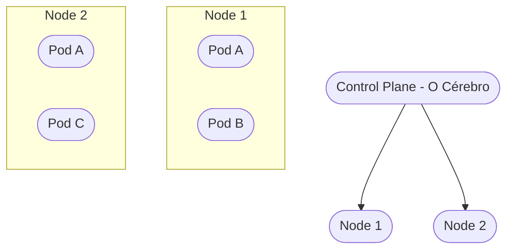

# Aula 14 - Orquestração com Kubernetes e Runners ☸️

!!! tip "Objetivo"
    **Objetivo**: Compreender a necessidade de orquestração de contêineres, conhecer os conceitos básicos de Kubernetes (K8s) e entender como os Runners executam nossas tarefas de automação em larga escala.

---

## 1. O que fazer com 1000 Contêineres? 🤯

O Docker é ótimo para rodar um ou dez contêineres. Mas e se você tiver um sistema gigante com milhares de contêineres que precisam escalar conforme o número de usuários sobe e desce?

### 🧠 Conceito: Orquestração

=== "O Caos Manual"
    Sem orquestração, se um dos 1000 contêineres Docker travar, um humano precisaria rodar `docker restart`. Se o servidor ficar sem memória no meio da madrugada, alguém precisaria comprar outro servidor.
    
=== "O Maestro Kubernetes"
    A Orquestração automatiza o gerenciamento. O **K8s** (Kubernetes) atua como um maestro: ele monitora a saúde das aplicações, reinicia as que falharam ou travaram e aumenta os servidores (Scale Out) quando identificam picos de acessos.

---

## 2. Conceitos Chave do Kubernetes 🏗️

O K8s não fala "contêiner", ele fala **Pod**.

1.  **Pod**: A menor unidade (pode conter um ou mais contêineres).
2.  **Node**: Uma máquina física ou virtual (o "trabalhador") onde os Pods rodam.
3.  **Cluster**: O conjunto de todos os Nodes gerenciados pelo Kubernetes.
4.  **Deployment**: A definição de como o seu app deve rodar (ex: "quero sempre 3 cópias deste Pod ligadas").

### Visualização do Cluster (Mermaid)

---

## 3. Auto-Cura e Escala Automática 🦾

A grande mágica do Kubernetes é a **Auto-Cura**: se um contêiner travar ou um servidor desligar, o K8s percebe e sobe um novo contêiner em outra máquina automaticamente.

!!! note "Conceito"
    **Horizontal Pod Autoscaler (HPA)**: O K8s pode aumentar o número de Pods se o CPU da sua aplicação estiver muito alto e diminuir quando o tráfego baixar.

---

## 4. O Papel dos Runners 🏃‍♂️

No mundo do CI/CD (que vimos na Aula 11), os **Runners** são os contêineres que "correm" para executar o seu código. No GitHub Actions, o GitHub fornece runners, mas grandes empresas criam seus próprios **Self-hosted Runners** em clusters Kubernetes para ter mais controle e velocidade.

---

## 5. Praticando a Lógica de Orquestração 🚀

1.  Imagine que você tem uma loja virtual.
2.  Normalmente, 3 servidores dão conta do recado.
3.  Chega a **Black Friday** e os acessos aumentam 10x.
4.  No seu bloco de notas, desenhe como o Kubernetes deveria agir:
    *   **Passo 1**: Perceber aumento de tráfego.
    *   **Passo 2**: Criar mais 27 cópias dos servidores (totalizando 30).
    *   **Passo 3**: Quando a Black Friday acabar, destruir 27 cópias para economizar dinheiro.

---

## 6. Exercício de Fixação 📝

1.  **Básico**: Por que o Kubernetes é chamado de "Orquestrador"?
2.  **Básico**: O que acontece se um servidor (Node) queimar em um cluster Kubernetes?
3.  **Intermediário**: Qual a diferença entre um **Pod** e um **Contêiner**?
4.  **Intermediário**: Explique o que é "Escalabilidade Horizontal".
5.  **Desafio**: Pesquise o que é o **Helm** e como ele se relaciona com o Kubernetes.

---

**Próxima Aula**: Vamos falar sobre como as pessoas se organizam com o [Slack e Microsoft Teams](./aula-15.md)! 💬
