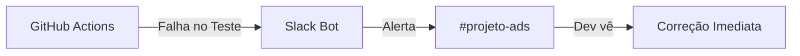

# Aula 15 - Comunicação e Colaboração em Equipe 💬

!!! tip "Objetivo"
    **Objetivo**: Entender a importância da comunicação eficaz em projetos de software, conhecer as ferramentas líderes de colaboração e aprender as melhores práticas de comunicação assíncrona.

---

## 1. O Código não é Tudo 🗣️

O sucesso de um projeto depende 50% da qualidade do código e 50% de quão bem a equipe se comunica. Mal-entendidos geram bugs, atrasos e frustração.

### 🧠 Conceito: Comunicação Assíncrona
É a comunicação que não exige que ambas as pessoas estejam presentes ao mesmo tempo (ex: mensagens de chat, e-mails, comentários no Git). É essencial para desenvolvedores, pois permite manter o "estado de fluxo" (concentração total).

---

## 2. Ferramentas de Mercado 🏢

### 🟦 Slack
A ferramenta favorita das startups e empresas de tecnologia.
*   **Destaque**: Integrações potentes (você pode receber alertas do GitHub ou do Jenkins direto no Slack).
*   **Recurso**: Canais organizados por projeto ou assunto.

### 🟪 Microsoft Teams
Muito comum em grandes corporações que já utilizam o ecossistema Office.
*   **Destaque**: Excelente integração para chamadas de vídeo e edição de documentos em tempo real.

---

## 3. Integração: ChatOps 🤖

Imagine que um teste falhou na sua pipeline (Aula 11). Em vez de você ter que abrir o GitHub para descobrir, um "bot" avisa a equipe no Slack imediatamente.

### Fluxo de Notificação

---

## 4. Etiqueta Digital para Devs 📜

*   **Evite o "Olá" vazio**: Não mande apenas "Oi" e espere a resposta. Mande sua dúvida completa de uma vez.
*   **Use Threads**: Responda a uma mensagem criando uma linha de conversa (thread) para não poluir o canal principal.
*   **Emojis**: Use para confirmar recebimento (ex: :white_check_mark: para "entendido") e economizar mensagens.

---

## 5. Prática: Configurando um Webhook (Lógica) 🚀

Webhooks são a forma como ferramentas "conversam" com o Slack:

1.  Imagine que você quer receber um aviso toda vez que um novo aluno entrar no curso.
2.  No seu bloco de notas, desenhe a lógica:
    *   **Trigger**: Cadastro de Aluno no Site.
    *   **Ação**: Enviar um JSON para a URL secreta do Slack.
    *   **Resultado**: Mensagem "Novo aluno registrado!" no canal #geral.

---

## 🔗 Materiais da Aula

- :material-presentation: **Slides**

    ---

    Material visual com diagramas e conceitos-chave.

    [:octicons-arrow-right-24: Slide 15](../slides/slide-15.html)

- :material-help-circle: **Quiz**

    ---

    Teste seu conhecimento com 10 questões interativas.

    [:octicons-arrow-right-24: Quiz 15](../quizzes/quiz-15.md)

- :fontawesome-solid-pencil: **Exercícios**

    ---

    5 exercícios progressivos (básico → desafio).

    [:octicons-arrow-right-24: Exercício 15](../exercicios/exercicio-15.md)

- :material-briefcase-outline: **Projeto**

    ---

    Aplicação prática dos conceitos da aula.

    [:octicons-arrow-right-24: Projeto 15](../projetos/projeto-15.md)

---

[➡️ Próxima Aula: Aula 16](./aula-16.md){ .md-button .md-button--primary }
