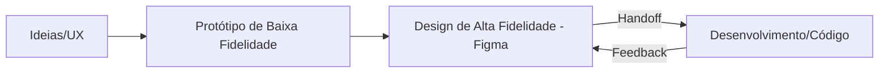

# Aula 16 - Design, Prototipagem e Handoff (Figma) 🎨

!!! tip "Objetivo"
    **Objetivo**: Compreender o papel do designer de interface (UI/UX), aprender a navegar no Figma para extrair informações técnicas e entender o processo de "Handoff" — a entrega do design para o desenvolvimento.

---

## 1. O que é o Figma? 🎨

O **Figma** é a ferramenta líder de mercado para design de interfaces. Diferente de softwares antigos, ele é baseado na nuvem e permite que designers e desenvolvedores trabalhem no mesmo arquivo simultaneamente.

### 🧠 Conceito: Design System
Muitas empresas utilizam um "Design System" no Figma. É uma biblioteca de componentes (botões, cores, fontes) padronizados que garantem que o aplicativo tenha a mesma cara em todas as telas.

---

## 2. Dev Mode: O Paraíso do Desenvolvedor 💻

Recentemente, o Figma lançou o **Dev Mode**, uma interface pensada exclusivamente para programadores. Ao clicar em um elemento, você pode ver:
*   **CSS / Código**: Largura, altura, cores em Hexadecimal/RGB.
*   **Assets**: Exportar imagens e ícones diretamente em SVG ou PNG.
*   **Spacing**: Ver a distância exata entre um botão e um texto.

---

## 3. O Processo de Handoff 🤝

Handoff é o momento em que o designer termina o protótipo e o entrega para o desenvolvedor começar a codificar.

### Fluxo de Trabalho



---

## 4. Praticando a Inspeção 🔍

Mesmo sem o Figma aberto, imagine que você está inspecionando um botão no "Dev Mode":

```css
/* Propriedades extraídas do Figma */
.botao-primario {
  width: 200px;
  height: 48px;
  background-color: #6200EE;
  border-radius: 8px;
  color: #FFFFFF;
  font-family: 'Inter', sans-serif;
  font-weight: 600;
}
```

---

## 5. Prática: Explorando um Protótipo 🚀

Sua missão final é entrar no mundo do design:

1.  Crie uma conta gratuita no **Figma**.
2.  Busque na "Community" do Figma por um arquivo chamado **"Material 3 Design Kit"**.
3.  Abra o arquivo e tente encontrar a seção de **Buttons**.
4.  Use a ferramenta de "Inspeção" para descobrir qual a cor hexadecimal do botão principal.
5.  Tente alterar o texto de um botão apenas para entender como a ferramenta funciona.

---

## 📝 Prática Sugerida

Para consolidar o conhecimento desta aula, realize os exercícios propostos:

👉 **[Ver Exercícios da Aula 16](../exercicios/exercicio-16.md)**
👉 **[Ver Projeto da Aula 16](../projetos/projeto-16.md)**

---

**Parabéns!** Você concluiu as 16 aulas do **Guia de Ferramentas**. Agora você tem o cinto de utilidades completo para brilhar no mercado de ADS! 🎓✨

