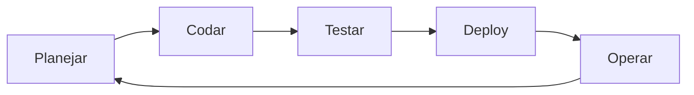

# Aula 01: Introdução ao Ecossistema de Ferramentas 🌐

---

## 🎯 Nosso Objetivo Hoje
*   Entender o ecossistema do desenvolvedor moderno.
*   Diferenciar as categorias de ferramentas.
*   Conhecer o poder da automação.
*   Primeiros passos no Terminal.

---

## 🚀 Por que ferramentas importam?
*   Economia de Tempo ⏳
*   Padronização 📏
*   Qualidade do Código 💎
*   Trabalho em Equipe 🤝

---

## 🧩 O "Cinto de Utilidades" do Dev
Um desenvolvedor profissional não vive apenas de escrever código.
Ele gerencia:
*   Tarefas { .fragment }
*   Versões { .fragment }
*   Ambientes { .fragment }
*   Qualidade { .fragment }

---

## 🛠️ Categorias de Ferramentas
1.  **Gestão de Projetos** (Jira, Trello) { .fragment }
2.  **Ambiente de Dev** (VS Code, Terminal) { .fragment }
3.  **Controle de Versão** (Git, GitHub) { .fragment }
4.  **Banco de Dados** (Postgres, DBeaver) { .fragment }

---

## 🛠️ Categorias de Ferramentas (Cont.)
5.  **Qualidade e Testes** (Jest, Sonar) { .fragment }
6.  **Infraestrutura e CI/CD** (Docker, Actions) { .fragment }
7.  **Comunicação** (Slack, Teams) { .fragment }
8.  **Design** (Figma) { .fragment }

---

## 🧠 Conceito: Automação
> "Se você faz a mesma coisa mais de 3 vezes, você deve automatizá-la."

---

## 📈 O Ciclo de Vida do Software

---

## 💻 IDE vs Editor de Código
*   **Editor**: Leve, rápido, extensível (ex: VS Code). { .fragment }
*   **IDE**: Completa, "pesada", ferramentas nativas (ex: IntelliJ). { .fragment }

---

## 🖥️ O Poder do Terminal (CLI)
A interface de linha de comando é a casa do desenvolvedor.
*   **Rapidez**: Sem cliques infinitos. { .fragment }
*   **Scripts**: Repetir tarefas complexas. { .fragment }
*   **Controle**: Acesso total ao sistema. { .fragment }

---

## ⌨️ Comandos Básicos (Terminal)
*   `ls`: Listar arquivos. { .fragment }
*   `cd`: Entrar em pasta. { .fragment }
*   `mkdir`: Criar pasta. { .fragment }
*   `pwd`: Onde eu estou? { .fragment }

---

## 📂 Organização de Pastas
Mantenha seus projetos organizados!
*   Ex: `~/SourceCode/REPOS/github/` { .fragment }
*   Evite espaços nos nomes de pastas. { .fragment }
*   Use `hifen-ou-underscore`. { .fragment }

---

## 🦀 Ferramentas de Gestão
*   **Jira**: O padrão corporativo. { .fragment }
*   **Trello**: Visual e simples (Kanban). { .fragment }
*   **GitHub Issues**: Integrado ao código. { .fragment }

---

## 🐙 O Ecossistema Git
*   **Git**: O software local. { .fragment }
*   **GitHub**: A rede social do código. { .fragment }
*   **GitLab**: Foco em CI/CD e empresas. { .fragment }

---

## 📦 O Mundo dos Contêineres
O que é Docker?
*   Empacota o app. { .fragment }
*   Funciona igual em todo lugar. { .fragment }
*   "Na minha máquina funciona" acabou! { .fragment }

---

## 💎 Qualidade de Código
*   **Linters**: Corretor ortográfico de código. { .fragment }
*   **Formatters**: Deixa o código padronizado. { .fragment }
*   **Testes**: Garante que nada quebra. { .fragment }

---

## 📡 Ferramentas de API
Testando a comunicação entre sistemas.
*   Postman { .fragment }
*   Insomnia { .fragment }

---

## 🎨 O Elo com o Design
*   **Figma**: Onde o app nasce visualmente.
*   **Handoff**: A entrega para o desenvolvedor.

---

## 🏆 Conclusão da Intro
Você não precisa dominar todas hoje.
*   Escolha uma de cada categoria. { .fragment }
*   Pratique a linha de comando. { .fragment }
*   Mantenha a curiosidade ativa. { .fragment }

---

## 📝 Próximos Passos
1.  Instalar o VS Code.
2.  Configurar o Git.
3.  Criar conta no GitHub.

---

## 🏁 Dúvidas?
Vamos para a prática! 🚀
