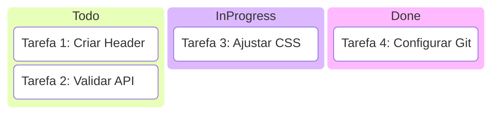
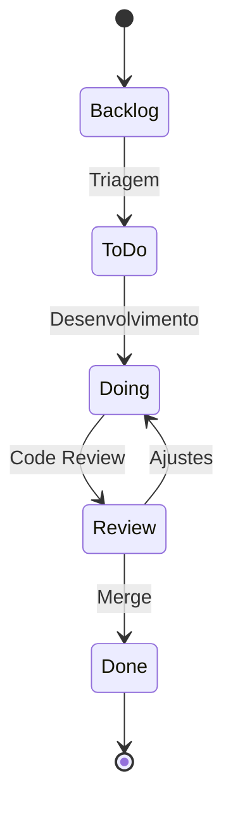

# Aula 02: Gestão de Projetos e Tarefas 📊

---

## 🎯 O que vamos ver hoje?
*   A importância da organização.
*   Metodologias Ágeis (Kanban).
*   Ferramentas: Trello, Jira, GitHub Issues.
*   Conceitos: Backlog, Sprints, Prioridade.

---

## 😫 O Caos Sem Ferramentas
*   Esquecer tarefas importantes. { .fragment }
*   Dois devs fazendo a mesma coisa. { .fragment }
*   Não saber o que entregar amanhã. { .fragment }
*   Perder o histórico de decisões. { .fragment }

---

## 🧠 Metodologia Ágil
Não é sobre trabalhar mais, é sobre trabalhar **melhor**.
*   Entregas constantes. { .fragment }
*   Flexibilidade a mudanças. { .fragment }
*   Transparência total no time. { .fragment }

---

## 🛹 O quadro Kanban
Uma forma visual de ver o fluxo de trabalho.
*   **To Do**: O que precisa ser feito. { .fragment }
*   **Doing**: O que está sendo feito. { .fragment }
*   **Done**: O que já terminou. { .fragment }

---

## 📊 Visualização do Kanban

---

## 📂 O Backlog
O "estoque" de ideias e necessidades.
*   Sugestões de usuários. { .fragment }
*   Bugs encontrados. { .fragment }
*   Melhorias técnicas. { .fragment }
*   Nada é perdido! { .fragment }

---

## 🏆 Priorização
Nem tudo é urgente.
*   **Crítico**: Site fora do ar. { .fragment }
*   **Alto**: Cadastro não funciona. { .fragment }
*   **Médio**: Botão com cor errada. { .fragment }
*   **Baixo**: Mudar ícone do rodapé. { .fragment }

---

## 🟦 Trello: A Simplicidade Visual
*   Baseado em Cartões e Listas. { .fragment }
*   Fácil para times pequenos. { .fragment }
*   Extensões (Power-Ups). { .fragment }
*   Gratuito e intuitivo. { .fragment }

---

## 🏗️ Jira: O Poder Corporativo
*   Feito para Software (Agile). { .fragment }
*   Relatórios avançados (Burndown). { .fragment }
*   Fluxos de trabalho customizáveis. { .fragment }
*   Integração profunda com código. { .fragment }

---

## 🐙 GitHub Issues
*   Gestão dentro do repositório. { .fragment }
*   Links diretos com commits. { .fragment }
*   Suporte a Checklists e Milestones. { .fragment }
*   Ideal para Open Source. { .fragment }

---

## 🔄 Status de uma Tarefa (Exemplo)

---

## ⏰ Sprints e Ciclos
Organizando o tempo.
*   **Sprint**: Ciclo de 1 a 4 semanas. { .fragment }
*   **Planning**: O que faremos agora? { .fragment }
*   **Review**: O que entregamos? { .fragment }

---

## 🛑 Impedimentos (Blockers)
"Não consigo avançar porque..."
*   Dependência de outro time. { .fragment }
*   Falta de acesso a um servidor. { .fragment }
*   Dúvida no requisito. { .fragment }
*   **Identifique rápido!** { .fragment }

---

## 🏷️ O Uso de Labels
Categorize suas tarefas:
*   `bug` 🔴 { .fragment }
*   `feature` 🟢 { .fragment }
*   `documentation` 🔵 { .fragment }
*   `blocker` ⚠️ { .fragment }

---

## 🤝 Colaboração no Card
*   Comentários para histórico. { .fragment }
*   Menções (@usuario). { .fragment }
*   Anexo de prints e logs. { .fragment }
*   **Evite conversas importantes fora do card!** { .fragment }

---

## 📈 Estimativas (Story Points)
Quanto esforço essa tarefa exige?
*   1: Simples (mudar texto). { .fragment }
*   5: Média (criar página). { .fragment }
*   13: Complexa (nova feature). { .fragment }

---

## 🤖 Integração: Chat + Gestão
*   Bot do Jira no Slack. { .fragment }
*   Notificação quando PR é aberto. { .fragment }
*   Transparência sem esforço. { .fragment }

---

## 🏆 Checklist de Sucesso
*   [ ] Kanban atualizado diariamente. { .fragment }
*   [ ] Tarefas pequenas e claras. { .fragment }
*   [ ] Prioridades bem definidas. { .fragment }
*   [ ] Ninguém com 5 tarefas "Doing". { .fragment }

---

## 📝 Prática de Hoje
*   Criar um quadro no Trello/Jira.
*   Adicionar 5 tarefas reais do seu semestre.
*   Priorizar e colocar prazos.

---

## 🏁 Dúvidas?
Organização é metade do caminho! 🚀
