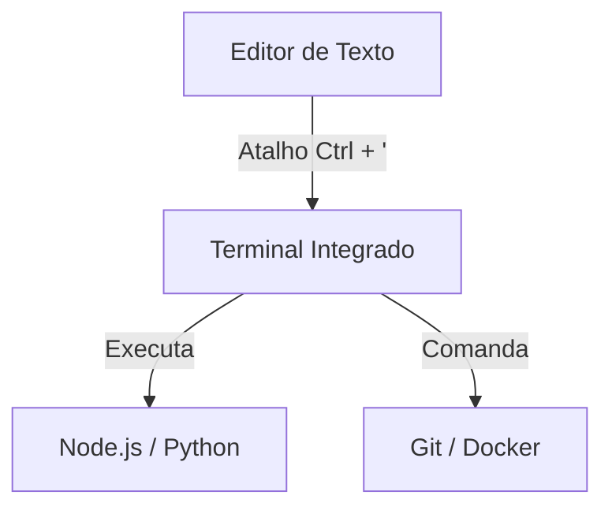

# Aula 03: Ambiente de Desenvolvimento 💻

---

## 🎯 Nosso Foco
*   Dominar o VS Code.
*   Configurar extensões essenciais.
*   Navegar pelo Terminal com confiança.
*   Customizar seu workflow.

---

## 🏗️ Por que investir no ambiente?
*   Menos tempo configurando, mais tempo criando. { .fragment }
*   Erros capturados antes de rodar o código. { .fragment }
*   Saúde ocular e mental (Temas e Fontes). { .fragment }
*   **Seu computador é sua oficina!** { .fragment }

---

## 🟦 VS Code: O Rei dos Editores
*   Lançado pela Microsoft em 2015. { .fragment }
*   Escrito em TypeScript/Electron. { .fragment }
*   Arquitetura de plugins leve. { .fragment }
*   **Standard de mercado.** { .fragment }

---

## 🎨 Personalização Visual
*   **Temas**: Dracula, One Dark Pro, Night Owl. { .fragment }
*   **Ícones**: Material Icon Theme, vscode-icons. { .fragment }
*   **Fontes**: Fira Code, JetBrains Mono (Ligatures). { .fragment }

---

## 🔌 Extensões: Produtividade Pura
1.  **Prettier**: Formatação automática. { .fragment }
2.  **ESLint**: Análise de código em tempo real. { .fragment }
3.  **GitLens**: Quem escreveu essa linha? { .fragment }
4.  **Error Lens**: Erros destacados na linha. { .fragment }

---

## 🔌 Extensões: Utilidades
5.  **Path Intellisense**: Auto-completar caminhos de arquivos. { .fragment }
6.  **Auto Close/Rename Tag**: Agilidade no HTML. { .fragment }
7.  **Thunder Client**: Testar APIs dentro do editor. { .fragment }

---

## ⌨️ Atalhos do VS Code (Ninja Mode)
*   `Ctrl + P`: Abrir arquivo rapidamente. { .fragment }
*   `Ctrl + Shift + P`: Paleta de comandos. { .fragment }
*   `Alt + Up/Down`: Mover linha de lugar. { .fragment }
*   `Ctrl + D`: Selecionar próxima ocorrência. { .fragment }

---

## ⌨️ Atalhos do VS Code (Edição)
*   `Ctrl + /`: Comentar bloco de código. { .fragment }
*   `Ctrl + B`: Esconder barra lateral. { .fragment }
*   `Ctrl + '`: Abrir/Fechar Terminal. { .fragment }
*   `Ctrl + \`: Dividir o editor (Split View). { .fragment }

---

## 🖥️ O Terminal Integrado

---

## 🏠 Navegação de Diretórios
*   `pwd`: Print Working Directory (Onde estou?). { .fragment }
*   `ls -la`: Listar tudo (inclusive ocultos). { .fragment }
*   `cd ..`: Voltar uma pasta. { .fragment }
*   `cd ~`: Ir para a Home. { .fragment }

---

## 🔨 Manipulação de Arquivos
*   `touch index.js`: Criar arquivo vazio. { .fragment }
*   `mkdir src`: Criar pasta "src". { .fragment }
*   `mv velho.js novo.js`: Renomear. { .fragment }
*   `rm -rf pasta`: Deletar recursivamente (CUIDADO!). { .fragment }

---

## 🔍 Gerenciamento de Conteúdo
*   `cat file.txt`: Ver conteúdo no terminal. { .fragment }
*   `grep "erro" log.txt`: Buscar texto dentro do arquivo. { .fragment }
*   `echo "olá" > file.txt`: Escrever no arquivo. { .fragment }

---

## 💡 Dica de Ouro: Alias
Você pode criar apelidos para comandos longos!
*   `gs` -> `git status` { .fragment }
*   `ga` -> `git add .` { .fragment }
*   `gc` -> `git commit -m` { .fragment }

---

## 🐚 Alternativas de Terminal
*   **Windows**: WSL2 (Linux no Windows), PowerShell 7. { .fragment }
*   **Mac/Linux**: Zsh (Oh My Zsh), Fish Shell. { .fragment }

---

## 🛠️ Configurando o `settings.json`
Tudo no VS Code é texto!
*   Acesse com `Ctrl + Shift + P` > `Open User Settings (JSON)`. { .fragment }
*   Sincronize suas configurações com o GitHub. { .fragment }

---

## 📈 Autocomplete (IntelliSense)
*   Sugestões baseadas no contexto. { .fragment }
*   Documentação rápida ao passar o mouse. { .fragment }
*   **Snippets**: Pedaços de código prontos. { .fragment }

---

## 🦁 Debugging Diferenciado
*   Pare de usar `console.log` para tudo! { .fragment }
*   Use Breakpoints (pontos de parada). { .fragment }
*   Inspecione variáveis em tempo real no editor. { .fragment }

---

## 🏆 Checklist do Ambiente Pro
*   [ ] Tema escuro configurado. { .fragment }
*   [ ] Extensões de linting e format instaladas. { .fragment }
*   [ ] Atalhos básicos memorizados. { .fragment }
*   [ ] Terminal configurado com `zsh` ou `pwsh`. { .fragment }

---

## 📝 Prática de Hoje
1.  Customizar seu VS Code.
2.  Criar uma estrutura de 3 pastas via Terminal.
3.  Configurar o Auto-Format ao Salvar.

---

## 🏁 Dúvidas?
Seu ambiente, suas regras! 🚀