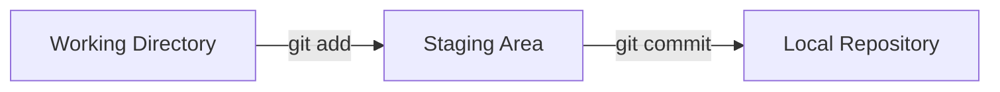

# Aula 04: Controle de Versão com Git 🛠️

---

## 🎯 Nossa Missão
*   Entender por que usar Git.
*   Dominar o fluxo local (Add/Commit).
*   Configurar sua identidade de desenvolvedor.
*   Aprender a "viajar no tempo" com o histórico.

---

## 😫 O Problema do "Final_v2_Revise.zip"
*   Qual arquivo é o último? { .fragment }
*   Como voltar se eu apagar tudo sem querer? { .fragment }
*   Como saber quem mudou o quê? { .fragment }
*   **O Git resolve tudo isso.** { .fragment }

---

## 🧠 O que é o Git?
*   Sistema de Controle de Versão **Distribuído**. { .fragment }
*   Criado por Linus Torvalds (o pai do Linux). { .fragment }
*   Rápido, leve e focado na integridade dos dados. { .fragment }

---

## ⚙️ Configuração Inicial
Antes de começar, o Git precisa saber quem você é.
```bash
git config --global user.name "Seu Nome"
git config --global user.email "seu@email.com"
```
*   Configura apenas uma vez por computador. { .fragment }

---

## 🏗️ As Três Áreas do Git


---

## 1. Working Directory 📂
É a pasta onde seus arquivos estão agora.
*   Onde você edita, cria e deleta.
*   O Git está observando as mudanças "em aberto".

---

## 2. Staging Area (ou Index) 🎟️
É a "sala de espera" para os arquivos que você quer salvar.
*   Você escolhe o que entra no palco. { .fragment }
*   Permite selecionar apenas alguns arquivos alterados. { .fragment }
*   Comando: `git add <arquivo>`. { .fragment }

---

## 3. Local Repository (Histórico) 📜
É onde as versões são salvas permanentemente na sua máquina.
*   Após o commit, a versão ganha um código (Hash). { .fragment }
*   Imutável e seguro. { .fragment }
*   Comando: `git commit -m "mensagem"`. { .fragment }

---

## 🚀 Inicializando um Repositório
```termynal
$ mkdir meu-projeto
$ cd meu-projeto
$ git init
Initialized empty Git repository in /.../.git/
```
*   Isso cria a pasta mágica `.git`. { .fragment }

---

## 🔍 Verificando o Estado
`git status`
*   Arquivos Vermelhos: Mudanças não preparadas. { .fragment }
*   Arquivos Verdes: Mudanças no Staging (prontas para commit). { .fragment }
*   Nada para comitar: Tudo limpo! { .fragment }

---

## 📝 A Arte da Mensagem de Commit
❌ Má prática: `ajustes`, `fix`, `commmit`, `v1`
✅ Boa prática (Conventional Commits):
*   `feat: adicionar tela de login` { .fragment }
*   `fix: corrigir erro no calculo de frete` { .fragment }
*   `docs: atualizar cronograma da aula` { .fragment }

---

## 📖 Consultando o Passado: `git log`
*   Lista todos os commits. { .fragment }
*   Mostra Autor, Data e Mensagem. { .fragment }
*   Exibe o **HASH** (ex: `a1b2c3d`). { .fragment }
*   Use `git log --oneline` para uma lista curta. { .fragment }

---

## 🕵️‍♂️ Ocultando o que não importa: `.gitignore`
Existem arquivos que **NÃO** devem ir para o Git:
*   Senhas e Chaves de API. { .fragment }
*   Pastas de bibliotecas (`node_modules`). { .fragment }
*   Arquivos temporários do Sistema (`.DS_Store`). { .fragment }
*   Configurações pessoais do editor. { .fragment }

---

## 💡 Como funciona o .gitignore?
Crie um arquivo chamado `.gitignore` e escreva os nomes das pastas/arquivos lá.
```text
node_modules/
.env
secret.txt
```

---

## 🔄 Fluxo Completo na Prática
1.  Edita o arquivo. { .fragment }
2.  `git status` (Ver o que mudou). { .fragment }
3.  `git add .` (Levar tudo para o palco). { .fragment }
4.  `git commit -m "feat: x"` (Salvar!). { .fragment }

---

## 🛳️ Diferença entre Git e GitHub
*   **Git**: O motor local. Funciona sem internet. { .fragment }
*   **GitHub**: O estacionamento de nuvem. Ferramenta social. { .fragment }
*   O Git envia para o GitHub (veremos na próxima aula!). { .fragment }

---

## ⚠️ Atenção aos Erros Comuns
*   Esquecer de fazer o `git add` antes do `commit`. { .fragment }
*   Tentar fazer `commit` sem mensagem. { .fragment }
*   Sair comitando arquivos de 1GB (use .gitignore!). { .fragment }

---

## 🏆 Checklist de Fundamentos
*   [ ] Repositório inicializado com `git init`. { .fragment }
*   [ ] Usuário e Email configurados. { .fragment }
*   [ ] Entende a diferença entre Add e Commit. { .fragment }
*   [ ] Sabe ler o `git status`. { .fragment }

---

## 📝 Prática de Hoje
1.  Criar uma pasta e iniciar o Git.
2.  Fazer 3 commits com mensagens diferentes.
3.  Criar um `.gitignore` e testar se funciona.

---

## 🏁 Dúvidas?
O Git é seu melhor amigo de agora em diante! 🚀
