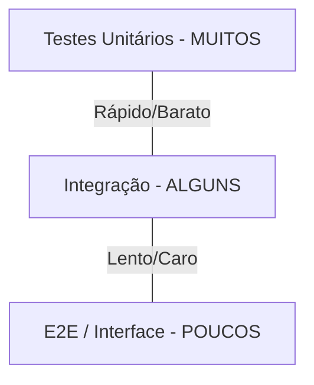

# Aula 08: Frameworks de Teste e Qualidade 🧪

---

## 🎯 Nossa Missão
*   Entender a importância dos testes automatizados.
*   Conhecer a Pirâmide de Testes.
*   Descobrir frameworks (Jest, PyTest, JUnit).
*   Introdução ao TDD (Test Driven Development).

---

## 😱 O Medo de Mudar o Código
*   "Se eu mexer aqui, o que será que quebra?" { .fragment }
*   "No meu PC funcionava, no servidor parou." { .fragment }
*   "O bug que eu corrigi ontem voltou hoje." { .fragment }
*   **Testes são a sua rede de segurança!** { .fragment }

---

## 🏗️ A Pirâmide de Testes


---

## 1. Testes Unitários 🧩
Testam a menor parte possível do código (funções isoladas).
*   **Vantagem**: Execução instantânea. { .fragment }
*   **Foco**: Lógica pura, cálculos, pequenas regras. { .fragment }
*   **Ferramentas**: Jest, PyTest. { .fragment }

---

## 2. Testes de Integração 🔗
Verificam se dois ou mais componentes funcionam bem juntos.
*   Ex: Aplicação + Banco de Dados. { .fragment }
*   Ex: Serviço A + API externa. { .fragment }
*   Buscam erros na comunicação entre partes. { .fragment }

---

## 3. Testes End-to-End (E2E) 🌐
Simulam o usuário real usando o sistema completo.
*   Abre o navegador, clica em botões, preenche forms. { .fragment }
*   **Custo**: São lentos e "frágeis" (quebram se o layout muda). { .fragment }
*   **Ferramentas**: Cypress, Playwright, Selenium. { .fragment }

---

## 🔴 Ciclo TDD (Red, Green, Refactor)
Uma nova forma de pensar o desenvolvimento:
1.  **Red**: Escreva um teste que falha (o código não existe). { .fragment }
2.  **Green**: Escreva o mínimo de código para o teste passar. { .fragment }
3.  **Refactor**: Melhore o código sem quebrar o teste. { .fragment }

---

## 🤡 O que são Mocks?
Simulando o mundo real.
*   Você não quer enviar um e-mail de verdade toda vez que rodar o teste. { .fragment }
*   Você cria um "objeto dublê" que finge ser o serviço de e-mail. { .fragment }
*   Isso isola o teste e o deixa muito mais rápido. { .fragment }

---

## 📦 Framework: Jest (JavaScript)
*   Simples: `expect(soma(2,2)).toBe(4)`. { .fragment }
*   Extremamente rápido (paralelismo). { .fragment }
*   Inclui ferramentas de Cobertura de Código. { .fragment }

---

## 🐍 Framework: PyTest (Python)
*   Sintaxe limpa: `assert soma(2,2) == 4`. { .fragment }
*   Poderoso sistema de Fixtures (preparação de dados). { .fragment }
*   Ecossistema de plugins gigante. { .fragment }

---

## ☕ Framework: JUnit (Java)
*   O avô dos frameworks modernos. { .fragment }
*   Robusto e integrado nativamente com IDEs. { .fragment }
*   Padrão absoluto no mundo corporativo Java. { .fragment }

---

## 📊 Cobertura de Código (Coverage)
"Quanto do meu projeto está sendo testado?"
*   Gera relatórios mostrando quais linhas foram executadas pelos testes. { .fragment }
*   **Meta**: 80% a 90% (100% é quase impossível e caro). { .fragment }

---

## 💎 Qualidade de Código (Linting)
Diferente de testes, o Linter foca na "estética" e "segurança estática".
*   ESLint (JS), Flake8 (Python). { .fragment }
*   Evita variáveis não usadas. { .fragment }
*   Garante estilos uniformes. { .fragment }

---

## 🔄 Testes na Pipeline (CI)
Nunca confie apenas no teste local!
*   A pipeline roda os testes a cada `git push`. { .fragment }
*   Impede que código "quebrado" chegue na produção. { .fragment }
*   Feedback automático para o time. { .fragment }

---

## 🧪 Anatomia de um Teste
```javascript
test('deve somar dois números corretamente', () => {
  // 1. Arrange (Preparar)
  const a = 10;
  const b = 5;

  // 2. Act (Agir)
  const resultado = soma(a, b);

  // 3. Assert (Verificar)
  expect(resultado).toBe(15);
});
```

---

## 🏆 Checklist de Qualidade Pro
*   [ ] Entende os níveis da pirâmide. { .fragment }
*   [ ] Sabe o que é um Mock e por que usar. { .fragment }
*   [ ] Instalou um framework de teste no seu projeto. { .fragment }
*   [ ] Entende o ciclo básico do TDD. { .fragment }

---

## 📝 Prática de Hoje
1.  Criar uma função simples de cálculo.
2.  Escrever um teste unitário para ela usando Jest ou PyTest.
3.  Ver o teste passar e o teste falhar (mudando a expectativa).

---

## 🏁 Dúvidas?
Dormir tranquilo = Ter uma boa suite de testes! 🚀💤