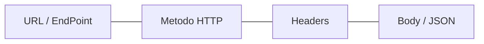
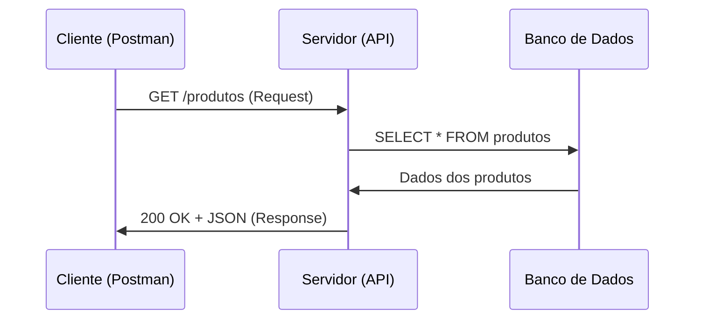

# Aula 09: Ferramentas de API (Postman / Insomnia) 📡

---

## 🎯 Nossa Missão
*   Entender o que é uma API e como ela se comunica.
*   Dominar os métodos HTTP (GET, POST, etc.).
*   Decifrar os códigos de status (200, 404, 500).
*   Usar Clients HTTP como Postman e Insomnia.

---

## 🔌 O que é uma API?
Application Programming Interface.
*   O "garçom" que leva seu pedido ao servidor e traz a resposta. { .fragment }
*   Permite que sistemas diferentes falem a mesma língua. { .fragment }
*   **Exemplo**: Seu app de clima buscando dados do satélite. { .fragment }

---

## 🏗️ Anatomia de uma Requisição


---

## 🛤️ Endpoints: O Caminho
*   `https://api.loja.com/v1/produtos` { .fragment }
*   `https://api.loja.com/v1/usuarios/123` { .fragment }
*   É o endereço específico onde o recurso mora. { .fragment }

---

## 🛠️ Métodos HTTP: Os Verbos
O que você quer fazer com o dado?
*   **GET**: Buscar informações. { .fragment }
*   **POST**: Criar algo novo. { .fragment }
*   **PUT**: Atualizar algo existente (completo). { .fragment }
*   **PATCH**: Atualizar algo existente (parcial). { .fragment }
*   **DELETE**: Remover algo. { .fragment }

---

## 📦 O Request Body (JSON)
Em métodos como POST e PUT, enviamos dados.
```json
{
  "nome": "Smartphone X",
  "preco": 1500.00,
  "cor": "Preto"
}
```
*   **JSON** é o padrão de ouro da web moderna. { .fragment }

---

## 🆔 Headers: Informações Extras
*   `Content-Type: application/json` { .fragment }
*   `Authorization: Bearer <TOKEN>` { .fragment }
*   Dizem ao servidor quem você é e o que está enviando. { .fragment }

---

## 🚦 Status Codes: A Resposta
Como saber se deu certo?
*   **2xx (Sucesso)**: 200 OK, 201 Created. { .fragment }
*   **3xx (Redirecionamento)**: 301 Moved. { .fragment }
*   **4xx (Erro do Cliente)**: 404 Not Found, 401 Unauthorized. { .fragment }
*   **5xx (Erro do Servidor)**: 500 Internal Error. { .fragment }

---

## 🟠 Postman / 🟣 Insomnia
Clients HTTP que facilitam a vida.
*   Não precisa de frontend para testar o backend. { .fragment }
*   Organize requisições em **Collections**. { .fragment }
*   Automatize testes de resposta. { .fragment }
*   Gere documentação automática. { .fragment }

---

## 🌍 O Fluxo da Requisição


---

## 🛡️ Autenticação em APIs
Sua API não pode ser aberta para qualquer um!
*   **API Keys**: Chaves simples. { .fragment }
*   **OAuth2**: Padrão de apps grandes (Google/GitHub). { .fragment }
*   **JWT (JSON Web Token)**: O token que viaja no Header. { .fragment }

---

## 📂 Organização em Coleções
*   Agrupe por projeto ou por funcionalidade. { .fragment }
*   Use **Variáveis de Ambiente** (`{{url}}`). { .fragment }
*   Mude de "Localhost" para "Produção" com um clique! { .fragment }

---

## 📝 Documentação: Swagger e Open API
*   Seu colega de frontend precisa saber como usar sua API. { .fragment }
*   O Swagger gera uma página interativa para testes. { .fragment }
*   O Postman também permite publicar documentação. { .fragment }

---

## 🔍 Query Parameters
Filtrando o que você busca via URL.
*   `api.com/v1/produtos?categoria=livros&ordem=preco` { .fragment }
*   Tudo após o `?` são parâmetros de consulta. { .fragment }

---

## 🗃️ Path Parameters
Identificando um recurso específico.
*   `api.com/v1/usuarios/42` { .fragment }
*   O `42` é o ID dinâmico do usuário buscado. { .fragment }

---

## 🦁 Scripts e Testes no Postman
Você pode validar se o retorno foi correto automaticamente!
```javascript
pm.test("Status code is 200", function () {
    pm.response.to.have.status(200);
});
pm.test("Resposta deve ser JSON", function () {
    pm.response.to.be.json;
});
```

---

## 📉 Mock Servers: Agilidade
*   O backend ainda não está pronto? { .fragment }
*   O Postman cria um servidor "mentira" (Mock). { .fragment }
*   O frontend já pode começar a trabalhar com dados fakes! { .fragment }

---

## 🏆 Checklist de API Pro
*   [ ] Conhece os significados de 200, 201, 400, 404 e 500. { .fragment }
*   [ ] Sabe a diferença entre GET, POST, PUT e DELETE. { .fragment }
*   [ ] Criou sua primeira Collection no Postman/Insomnia. { .fragment }
*   [ ] Entende o papel do JSON no Request Body. { .fragment }

---

## 📝 Prática de Hoje
1.  Abrir o Postman ou Insomnia.
2.  Testar o endpoint da PokeAPI ou JSONPlaceholder.
3.  Analisar o JSON retornado e o Status Code.

---

## 🏁 Dúvidas?
Conectar sistemas é o que move a internet! 🚀📡
