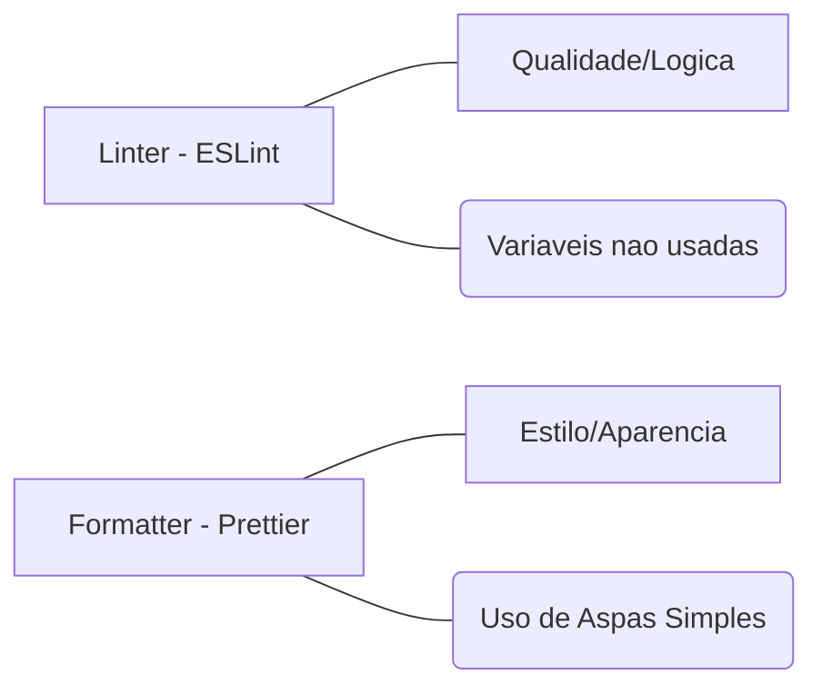

# Aula 10: Qualidade de Código (Linters e Formatters) ✨

---

## 🎯 Nossa Missão
*   Entender a análise estática de código.
*   Dominar o ESLint (Linter).
*   Dominar o Prettier (Formatter).
*   Padronizar o ambiente de desenvolvimento do time.

---

## 🤔 Por que a qualidade importa?
*   **Legibilidade**: Código é mais lido do que escrito. { .fragment }
*   **Manutenibilidade**: Mais fácil de consertar no futuro. { .fragment }
*   **Conformidade**: Todo o time escreve do mesmo jeito. { .fragment }
*   **Menos Bugs**: Erros bobos são pegos na hora. { .fragment }

---

## 📖 O que é Análise Estática?
Analisar o código sem executá-lo.
*   Procura por padrões perigosos. { .fragment }
*   Verifica se regras de estilo estão sendo seguidas. { .fragment }
*   Informa o desenvolvedor instantaneamente no editor. { .fragment }

---

## 🛑 Erros Comuns que Linters Pegam
*   Variáveis declaradas mas nunca usadas. { .fragment }
*   Chamar funções que não foram definidas. { .fragment }
*   Uso de `var` em vez de `const/let` no JS. { .fragment }
*   Falta de ponto e vírgula (onde é obrigatório). { .fragment }

---

## 🕵️‍♂️ ESLint: O Detetive do Código
*   O Linter mais popular do mundo JavaScript. { .fragment }
*   Extremamente configurável. { .fragment }
*   Possui conjuntos de regras prontos (ex: Airbnb, Google). { .fragment }

---

## 🎨 Prettier: O Artista do Código
*   A única preocupação dele é o **estilo visual**.
*   Onde colocar o espaço? Onde quebrar a linha?
*   O Prettier é "opinativo": ele decide o melhor visual para você não perder tempo discutindo. { .fragment }

---

## ⚖️ Linter vs Formatter


---

## ⚙️ Configurando o ESLint
Arquivo `.eslintrc.json`
```json
{
  "rules": {
    "no-console": "warn",
    "semi": ["error", "always"]
  }
}
```
*   **Off**: Desligado. { .fragment }
*   **Warn**: Amarelo (Aviso). { .fragment }
*   **Error**: Vermelho (Bloqueia o commit). { .fragment }

---

## 💎 Configurando o Prettier
Arquivo `.prettierrc`
```json
{
  "singleQuote": true,
  "trailingComma": "all",
  "tabWidth": 2
}
```
*   Configura uma vez, aplica no projeto inteiro! { .fragment }

---

## ⌨️ Integração com VS Code
*   Instala as extensões oficiais. { .fragment }
*   Ativa o "Format on Save". { .fragment }
*   **Mágica**: Você escreve o código bagunçado, aperta `Ctrl + S` e ele se organiza sozinho! { .fragment }

---

## 🏗️ Extensões de Regras
Muitos frameworks trazem suas próprias regras de lint:
*   `eslint-plugin-react` { .fragment }
*   `eslint-plugin-vue` { .fragment }
*   `eslint-plugin-security` { .fragment }

---

## 🛠️ Comando `fix`
O ESLint pode consertar os erros para você!
```bash
npx eslint . --fix
```
*   Resolve automaticamente problemas de indentação e erros simples de sintaxe. { .fragment }

---

## 🤫 Por que não usar `console.log` em produção?
*   Exibe dados sensíveis no navegador. { .fragment }
*   Diminui a performance do app. { .fragment }
*   O Linter nos ajuda a lembrar de remover logs de teste. { .fragment }

---

## 🧠 Dívida Técnica
Cada regra ignorada hoje é um problema amanhã.
*   O Linter ajuda a manter a dívida sob controle. { .fragment }
*   Evita o "Código Espaguete". { .fragment }

---

## 🤝 EditorConfig: O Irmão do Meio
O arquivo `.editorconfig` ajuda a manter a indentação correta mesmo em editores diferentes.
*   `indent_style = space` { .fragment }
*   `indent_size = 2` { .fragment }

---

## 🛡️ Linting no CI (GitHub Actions)
*   A build só passa se o Linter der "OK". { .fragment }
*   Ninguém consegue enviar código "sujo" para a branch principal. { .fragment }

---

## 🏆 Checklist de Qualidade Pro
*   [ ] ESLint e Prettier configurados no projeto. { .fragment }
*   [ ] "Format on Save" ativado no VS Code. { .fragment }
*   [ ] Entende a diferença entre aviso e erro. { .fragment }
*   [ ] Arquivos de configuração versionados no Git. { .fragment }

---

## 📝 Prática de Hoje
1.  Instalar o ESLint e Prettier via npm.
2.  Criar os arquivos de configuração.
3.  Bagunçar um código e deixar o editor consertar sozinho.

---

## 🏁 Dúvidas?
Código limpo é código profissional! 🚀✨