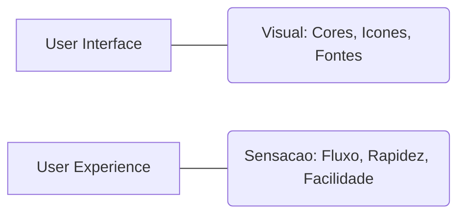

# Aula 16: Design, Prototipagem e Handoff 🎨

---

## 🎯 Nossa Missão
*   Entender o papel do Design no desenvolvimento.
*   Conhecer o Figma e suas ferramentas.
*   Dominar o processo de Handoff (passagem de bastão).
*   Aprender a inspecionar elementos para codar.

---

## 🧠 Por que desenvolvedores precisam entender design?
*   Para evitar o "Efeito Telefone Sem Fio". { .fragment }
*   Para saber o que é possível (ou não) implementar. { .fragment }
*   Para garantir que o produto final seja fiel ao planejado. { .fragment }
*   **Designers e Devs devem ser melhores amigos!** { .fragment }

---

## 🟦 O que é o Figma?
*   Ferramenta de design baseada em navegador. { .fragment }
*   Colaboração em tempo real (multi-player). { .fragment }
*   Foco em UI (Interface) e UX (Experiência). { .fragment }
*   Gratuito para estudantes! { .fragment }

---

## 🏗️ Conceitos: UI vs UX

---

## 📐 Prototipagem: Dando Vida ao Desenho
*   Conectar telas com cliques. { .fragment }
*   Testar o fluxo do usuário sem escrever uma linha de código. { .fragment }
*   Validar ideias com clientes rapidamente. { .fragment }

---

## 🤝 O Processo de Handoff
"A entrega do design para a engenharia."
*   O Designer termina o visual. { .fragment }
*   O Desenvolvedor recebe o acesso ao arquivo. { .fragment }
*   O arquivo deve conter as especificações técnicas. { .fragment }

---

## 🛠️ Figma Dev Mode
A visão "Matrix" do desenvolvedor.
*   Gera propriedades CSS automaticamente. { .fragment }
*   Mostra espaçamentos exatos (padding/margin). { .fragment }
*   Permite exportar ícones e imagens com um clique. { .fragment }

---

## 🎨 Cores e Tipografia
*   **Hexadecimal**: O padrão das cores (#FF5500). { .fragment }
*   **Font-Family**: Qual fonte usar? { .fragment }
*   **Font-Weight**: Qual o peso (negrito/leve)? { .fragment }

---

## 📦 Componentes e Design Systems
Não desenhamos telas, desenhamos peças.
*   **Atômico**: Botões, Inputs, Ícones. { .fragment }
*   **Moléculas**: Barra de buscas, Cards. { .fragment }
*   **Organismos**: Header, Footer. { .fragment }
*   No código, isso vira **Componentes Reutilizáveis**. { .fragment }

---

## 📐 Inspecionando Espaçamentos
*   Segure a tecla `Alt` para ver a distância entre elementos. { .fragment }
*   Evite o "olhômetro". Use os números do design! { .fragment }

---

## 🖼️ Exportando Assets
*   **SVG**: Para ícones e logos (vetorial, não perde qualidade). { .fragment }
*   **PNG/JPG**: Para fotos pesadas. { .fragment }
*   O Figma permite exportar em várias escalas (1x, 2x, 3x). { .fragment }

---

## 📱 Responsividade (Auto-Layout)
*   Como o design se comporta em telas pequenas? { .fragment }
*   O Auto-Layout do Figma simula o Flexbox do CSS. { .fragment }
*   Entender isso facilita muito a vida do dev frontend. { .fragment }

---

## 🦁 Bibliotecas de UI Reais
Empresas têm seus próprios padrões:
*   **Material Design** (Google). { .fragment }
*   **Human Interface Guidelines** (Apple). { .fragment }
*   **Fluent** (Microsoft). { .fragment }

---

## 🛡️ Acessibilidade (a11y) no Design
*   Contraste de cores (texto legível). { .fragment }
*   Tamanho de clique adequado para dedos no mobile. { .fragment }
*   O designer planeja, o dev implementa o código semântico. { .fragment }

---

## 🔄 Ferramentas de Handoff Alternativas
*   Zeplin. { .fragment }
*   InVision. { .fragment }
*   (O Figma hoje domina o mercado quase sozinho). { .fragment }

---

## 🏆 Checklist de Design Pro
*   [ ] Sabe navegar pelo arquivo Figma. { .fragment }
*   [ ] Entende como usar o Dev Mode. { .fragment }
*   [ ] Diferencia SVG de PNG. { .fragment }
*   [ ] Consegue extrair cores e fontes sem ajuda. { .fragment }

---

## 📝 Prática de Hoje
1.  Acessar um projeto público no Figma.
2.  Inspecionar um botão e copiar seu CSS.
3.  Exportar um ícone em formato SVG.

---

## 🏁 Dúvidas?
O design é o mapa, você é o construtor! 🚀🎨