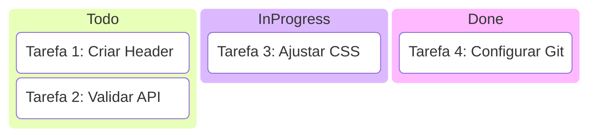
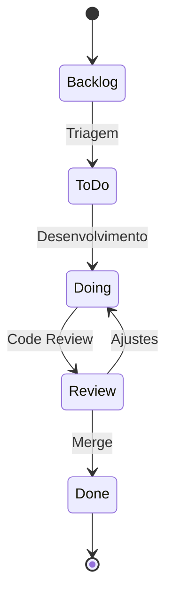

# Aula 02: Gestão de Projetos e Tarefas 📊

---

## 🎯 O que vamos ver hoje?
*   A importância da organização.
*   Metodologias Ágeis (Kanban).
*   Ferramentas: Trello, Jira, GitHub Issues.
*   Conceitos: Backlog, Sprints, Prioridade.

---

## 😫 O Caos Sem Ferramentas
*   Esquecer tarefas importantes. <!-- .element: class="fragment" -->
*   Dois devs fazendo a mesma coisa. <!-- .element: class="fragment" -->
*   Não saber o que entregar amanhã. <!-- .element: class="fragment" -->
*   Perder o histórico de decisões. <!-- .element: class="fragment" -->

---

## 🧠 Metodologia Ágil
Não é sobre trabalhar mais, é sobre trabalhar **melhor**.
*   Entregas constantes. <!-- .element: class="fragment" -->
*   Flexibilidade a mudanças. <!-- .element: class="fragment" -->
*   Transparência total no time. <!-- .element: class="fragment" -->

---

## 🛹 O quadro Kanban
Uma forma visual de ver o fluxo de trabalho.
*   **To Do**: O que precisa ser feito. <!-- .element: class="fragment" -->
*   **Doing**: O que está sendo feito. <!-- .element: class="fragment" -->
*   **Done**: O que já terminou. <!-- .element: class="fragment" -->

---

## 📊 Visualização do Kanban

---

## 📂 O Backlog
O "estoque" de ideias e necessidades.
*   Sugestões de usuários. <!-- .element: class="fragment" -->
*   Bugs encontrados. <!-- .element: class="fragment" -->
*   Melhorias técnicas. <!-- .element: class="fragment" -->
*   Nada é perdido! <!-- .element: class="fragment" -->

---

## 🏆 Priorização
Nem tudo é urgente.
*   **Crítico**: Site fora do ar. <!-- .element: class="fragment" -->
*   **Alto**: Cadastro não funciona. <!-- .element: class="fragment" -->
*   **Médio**: Botão com cor errada. <!-- .element: class="fragment" -->
*   **Baixo**: Mudar ícone do rodapé. <!-- .element: class="fragment" -->

---

## 🟦 Trello: A Simplicidade Visual
*   Baseado em Cartões e Listas. <!-- .element: class="fragment" -->
*   Fácil para times pequenos. <!-- .element: class="fragment" -->
*   Extensões (Power-Ups). <!-- .element: class="fragment" -->
*   Gratuito e intuitivo. <!-- .element: class="fragment" -->

---

## 🏗️ Jira: O Poder Corporativo
*   Feito para Software (Agile). <!-- .element: class="fragment" -->
*   Relatórios avançados (Burndown). <!-- .element: class="fragment" -->
*   Fluxos de trabalho customizáveis. <!-- .element: class="fragment" -->
*   Integração profunda com código. <!-- .element: class="fragment" -->

---

## 🐙 GitHub Issues
*   Gestão dentro do repositório. <!-- .element: class="fragment" -->
*   Links diretos com commits. <!-- .element: class="fragment" -->
*   Suporte a Checklists e Milestones. <!-- .element: class="fragment" -->
*   Ideal para Open Source. <!-- .element: class="fragment" -->

---

## 🔄 Status de uma Tarefa (Exemplo)

---

## ⏰ Sprints e Ciclos
Organizando o tempo.
*   **Sprint**: Ciclo de 1 a 4 semanas. <!-- .element: class="fragment" -->
*   **Planning**: O que faremos agora? <!-- .element: class="fragment" -->
*   **Review**: O que entregamos? <!-- .element: class="fragment" -->

---

## 🛑 Impedimentos (Blockers)
"Não consigo avançar porque..."
*   Dependência de outro time. <!-- .element: class="fragment" -->
*   Falta de acesso a um servidor. <!-- .element: class="fragment" -->
*   Dúvida no requisito. <!-- .element: class="fragment" -->
*   **Identifique rápido!** <!-- .element: class="fragment" -->

---

## 🏷️ O Uso de Labels
Categorize suas tarefas:
*   `bug` 🔴 <!-- .element: class="fragment" -->
*   `feature` 🟢 <!-- .element: class="fragment" -->
*   `documentation` 🔵 <!-- .element: class="fragment" -->
*   `blocker` ⚠️ <!-- .element: class="fragment" -->

---

## 🤝 Colaboração no Card
*   Comentários para histórico. <!-- .element: class="fragment" -->
*   Menções (@usuario). <!-- .element: class="fragment" -->
*   Anexo de prints e logs. <!-- .element: class="fragment" -->
*   **Evite conversas importantes fora do card!** <!-- .element: class="fragment" -->

---

## 📈 Estimativas (Story Points)
Quanto esforço essa tarefa exige?
*   1: Simples (mudar texto). <!-- .element: class="fragment" -->
*   5: Média (criar página). <!-- .element: class="fragment" -->
*   13: Complexa (nova feature). <!-- .element: class="fragment" -->

---

## 🤖 Integração: Chat + Gestão
*   Bot do Jira no Slack. <!-- .element: class="fragment" -->
*   Notificação quando PR é aberto. <!-- .element: class="fragment" -->
*   Transparência sem esforço. <!-- .element: class="fragment" -->

---

## 🏆 Checklist de Sucesso
*   [ ] Kanban atualizado diariamente. <!-- .element: class="fragment" -->
*   [ ] Tarefas pequenas e claras. <!-- .element: class="fragment" -->
*   [ ] Prioridades bem definidas. <!-- .element: class="fragment" -->
*   [ ] Ninguém com 5 tarefas "Doing". <!-- .element: class="fragment" -->

---

## 📝 Prática de Hoje
*   Criar um quadro no Trello/Jira.
*   Adicionar 5 tarefas reais do seu semestre.
*   Priorizar e colocar prazos.

---

## 🏁 Dúvidas?
Organização é metade do caminho! 🚀
