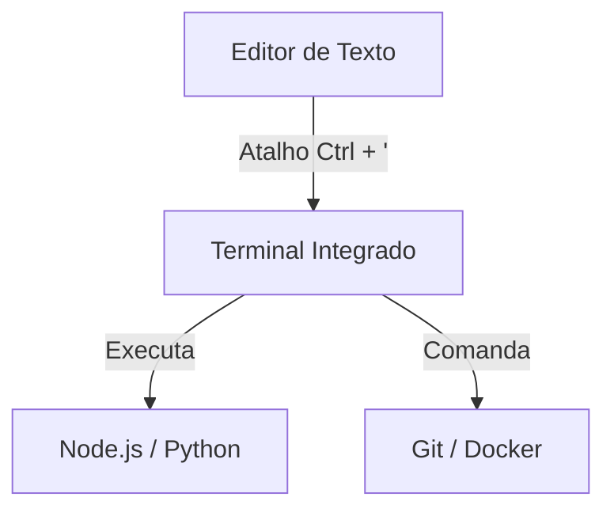

# Aula 03: Ambiente de Desenvolvimento 💻

---

## 🎯 Nosso Foco
*   Dominar o VS Code.
*   Configurar extensões essenciais.
*   Navegar pelo Terminal com confiança.
*   Customizar seu workflow.

---

## 🏗️ Por que investir no ambiente?
*   Menos tempo configurando, mais tempo criando. <!-- .element: class="fragment" -->
*   Erros capturados antes de rodar o código. <!-- .element: class="fragment" -->
*   Saúde ocular e mental (Temas e Fontes). <!-- .element: class="fragment" -->
*   **Seu computador é sua oficina!** <!-- .element: class="fragment" -->

---

## 🟦 VS Code: O Rei dos Editores
*   Lançado pela Microsoft em 2015. <!-- .element: class="fragment" -->
*   Escrito em TypeScript/Electron. <!-- .element: class="fragment" -->
*   Arquitetura de plugins leve. <!-- .element: class="fragment" -->
*   **Standard de mercado.** <!-- .element: class="fragment" -->

---

## 🎨 Personalização Visual
*   **Temas**: Dracula, One Dark Pro, Night Owl. <!-- .element: class="fragment" -->
*   **Ícones**: Material Icon Theme, vscode-icons. <!-- .element: class="fragment" -->
*   **Fontes**: Fira Code, JetBrains Mono (Ligatures). <!-- .element: class="fragment" -->

---

## 🔌 Extensões: Produtividade Pura
1.  **Prettier**: Formatação automática. <!-- .element: class="fragment" -->
2.  **ESLint**: Análise de código em tempo real. <!-- .element: class="fragment" -->
3.  **GitLens**: Quem escreveu essa linha? <!-- .element: class="fragment" -->
4.  **Error Lens**: Erros destacados na linha. <!-- .element: class="fragment" -->

---

## 🔌 Extensões: Utilidades
5.  **Path Intellisense**: Auto-completar caminhos de arquivos. <!-- .element: class="fragment" -->
6.  **Auto Close/Rename Tag**: Agilidade no HTML. <!-- .element: class="fragment" -->
7.  **Thunder Client**: Testar APIs dentro do editor. <!-- .element: class="fragment" -->

---

## ⌨️ Atalhos do VS Code (Ninja Mode)
*   `Ctrl + P`: Abrir arquivo rapidamente. <!-- .element: class="fragment" -->
*   `Ctrl + Shift + P`: Paleta de comandos. <!-- .element: class="fragment" -->
*   `Alt + Up/Down`: Mover linha de lugar. <!-- .element: class="fragment" -->
*   `Ctrl + D`: Selecionar próxima ocorrência. <!-- .element: class="fragment" -->

---

## ⌨️ Atalhos do VS Code (Edição)
*   `Ctrl + /`: Comentar bloco de código. <!-- .element: class="fragment" -->
*   `Ctrl + B`: Esconder barra lateral. <!-- .element: class="fragment" -->
*   `Ctrl + '`: Abrir/Fechar Terminal. <!-- .element: class="fragment" -->
*   `Ctrl + \`: Dividir o editor (Split View). <!-- .element: class="fragment" -->

---

## 🖥️ O Terminal Integrado

---

## 🏠 Navegação de Diretórios
*   `pwd`: Print Working Directory (Onde estou?). <!-- .element: class="fragment" -->
*   `ls -la`: Listar tudo (inclusive ocultos). <!-- .element: class="fragment" -->
*   `cd ..`: Voltar uma pasta. <!-- .element: class="fragment" -->
*   `cd ~`: Ir para a Home. <!-- .element: class="fragment" -->

---

## 🔨 Manipulação de Arquivos
*   `touch index.js`: Criar arquivo vazio. <!-- .element: class="fragment" -->
*   `mkdir src`: Criar pasta "src". <!-- .element: class="fragment" -->
*   `mv velho.js novo.js`: Renomear. <!-- .element: class="fragment" -->
*   `rm -rf pasta`: Deletar recursivamente (CUIDADO!). <!-- .element: class="fragment" -->

---

## 🔍 Gerenciamento de Conteúdo
*   `cat file.txt`: Ver conteúdo no terminal. <!-- .element: class="fragment" -->
*   `grep "erro" log.txt`: Buscar texto dentro do arquivo. <!-- .element: class="fragment" -->
*   `echo "olá" > file.txt`: Escrever no arquivo. <!-- .element: class="fragment" -->

---

## 💡 Dica de Ouro: Alias
Você pode criar apelidos para comandos longos!
*   `gs` -> `git status` <!-- .element: class="fragment" -->
*   `ga` -> `git add .` <!-- .element: class="fragment" -->
*   `gc` -> `git commit -m` <!-- .element: class="fragment" -->

---

## 🐚 Alternativas de Terminal
*   **Windows**: WSL2 (Linux no Windows), PowerShell 7. <!-- .element: class="fragment" -->
*   **Mac/Linux**: Zsh (Oh My Zsh), Fish Shell. <!-- .element: class="fragment" -->

---

## 🛠️ Configurando o `settings.json`
Tudo no VS Code é texto!
*   Acesse com `Ctrl + Shift + P` > `Open User Settings (JSON)`. <!-- .element: class="fragment" -->
*   Sincronize suas configurações com o GitHub. <!-- .element: class="fragment" -->

---

## 📈 Autocomplete (IntelliSense)
*   Sugestões baseadas no contexto. <!-- .element: class="fragment" -->
*   Documentação rápida ao passar o mouse. <!-- .element: class="fragment" -->
*   **Snippets**: Pedaços de código prontos. <!-- .element: class="fragment" -->

---

## 🦁 Debugging Diferenciado
*   Pare de usar `console.log` para tudo! <!-- .element: class="fragment" -->
*   Use Breakpoints (pontos de parada). <!-- .element: class="fragment" -->
*   Inspecione variáveis em tempo real no editor. <!-- .element: class="fragment" -->

---

## 🏆 Checklist do Ambiente Pro
*   [ ] Tema escuro configurado. <!-- .element: class="fragment" -->
*   [ ] Extensões de linting e format instaladas. <!-- .element: class="fragment" -->
*   [ ] Atalhos básicos memorizados. <!-- .element: class="fragment" -->
*   [ ] Terminal configurado com `zsh` ou `pwsh`. <!-- .element: class="fragment" -->

---

## 📝 Prática de Hoje
1.  Customizar seu VS Code.
2.  Criar uma estrutura de 3 pastas via Terminal.
3.  Configurar o Auto-Format ao Salvar.

---

## 🏁 Dúvidas?
Seu ambiente, suas regras! 🚀