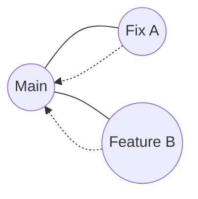
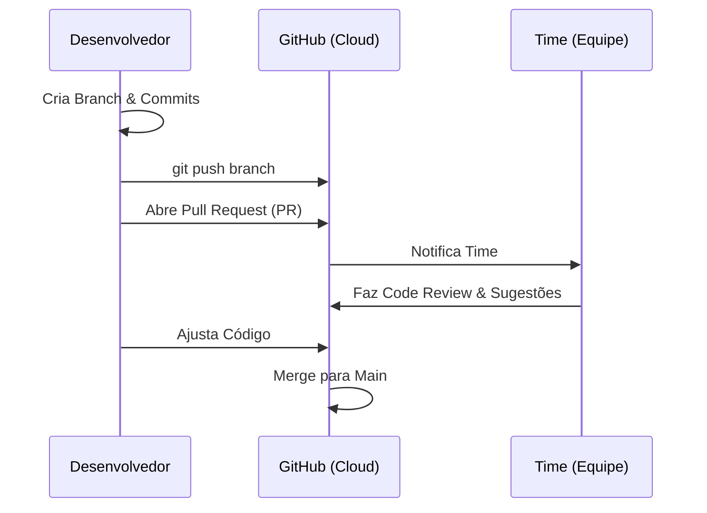

# Aula 05: Plataformas de Colaboração 🤝

---

## 🎯 Nossa Missão
*   Levar o código local para a nuvem.
*   Trabalhar em equipe sem sobrescrever o colega.
*   Dominar Pull Requests e Code Review.
*   Conhecer GitHub, GitLab e Bitbucket.

---

## ☁️ Por que usar repositórios remotos?
*   **Backup Seguro**: Se o PC pifar, o código está na nuvem. <!-- .element: class="fragment" -->
*   **Colaboração**: Várias pessoas no mesmo projeto. <!-- .element: class="fragment" -->
*   **Deploy**: Servidores buscam o código de lá. <!-- .element: class="fragment" -->
*   **Portfólio**: Mostrar seu trabalho para o mundo. <!-- .element: class="fragment" -->

---

## 🏢 O Big Three das Plataformas
1.  **GitHub**: A maior e mais social. <!-- .element: class="fragment" -->
2.  **GitLab**: Foco em empresas e CI/CD integrado. <!-- .element: class="fragment" -->
3.  **Bitbucket**: Integração nativa com Jira. <!-- .element: class="fragment" -->

---

## 🔗 Conectando Local com Remoto
`git remote add origin <url-do-servidor>`
*   **origin**: É o apelido padrão do seu servidor remoto. <!-- .element: class="fragment" -->
*   Você pode ter mais de um remoto (ex: `upstream`). <!-- .element: class="fragment" -->

---

## 🚀 Enviando Código: `git push`
O ato de "empurrar" seus commits para a nuvem.
```bash
git push -u origin main
```
*   `-u`: Salva a preferência (upstream), depois basta usar `git push`. <!-- .element: class="fragment" -->

---

## 📥 Trazendo Código: `git pull`
Sincronizando as mudanças que outros fizeram.
*   Executa um `fetch` (busca) + `merge` (une). <!-- .element: class="fragment" -->
*   Mantenha seu código local sempre atualizado! <!-- .element: class="fragment" -->

---

## 👯‍♀️ Clonando um Projeto: `git clone`
Baixando um repositório que já existe online.
*   Cria a pasta, inicia o git e baixa todos os arquivos. <!-- .element: class="fragment" -->
*   Baixa todo o histórico de commits. <!-- .element: class="fragment" -->

---

## 🌳 Trabalhando com Branches
O segredo da colaboração segura.

*   **Main**: Sempre código funcional e testado. <!-- .element: class="fragment" -->
*   **Features**: Branches para cada tarefa nova. <!-- .element: class="fragment" -->

---

## 🏗️ O Ciclo de Vida de uma Alteração


---

## 📝 O Pull Request (PR)
Não é apenas código, é uma conversa.
*   **Título Claro**: O que isso resolve? <!-- .element: class="fragment" -->
*   **Descrição**: Explique as mudanças complexas. <!-- .element: class="fragment" -->
*   **Prints/Vídeos**: Se houver mudança visual. <!-- .element: class="fragment" -->

---

## 🔍 Code Review: A Etapa de Ouro
Por que revisar código alheio?
*   Encontrar bugs que o autor não viu. <!-- .element: class="fragment" -->
*   Aprender novas técnicas. <!-- .element: class="fragment" -->
*   Garantir a padronização do time. <!-- .element: class="fragment" -->
*   **Seja gentil nas críticas!** <!-- .element: class="fragment" -->

---

## 👯‍♂️ Fork: Colaboração Externa
Muito comum em Open Source.
*   Você cria uma cópia do projeto de outra pessoa na sua conta. <!-- .element: class="fragment" -->
*   Faz as mudanças e envia um PR de volta para o autor original. <!-- .element: class="fragment" -->

---

## 🐙 GitHub: Recursos Sociais
*   **Stars**: Curtir um projeto. <!-- .element: class="fragment" -->
*   **Watch**: Receber notificações de mudanças. <!-- .element: class="fragment" -->
*   **Profile**: Seu currículo visual como dev. <!-- .element: class="fragment" -->

---

## 🛑 Cuidados com a Segurança
*   **NUNCA** envie senhas (`.env`) para o GitHub. <!-- .element: class="fragment" -->
*   Use Chaves SSH para conexão segura sem senha. <!-- .element: class="fragment" -->
*   Ative o Double Factor Authentication (2FA). <!-- .element: class="fragment" -->

---

## ⚠️ Lidando com Conflitos (Remoto)
Se você e um colega mudam a mesma linha:
1.  O `push` será rejeitado. <!-- .element: class="fragment" -->
2.  Você deve fazer `git pull`. <!-- .element: class="fragment" -->
3.  Resolver o conflito localmente. <!-- .element: class="fragment" -->
4.  Fazer novo `add/commit/push`. <!-- .element: class="fragment" -->

---

## 📊 Insights do GitHub
*   **Network Graph**: Visualizar as branches. <!-- .element: class="fragment" -->
*   **Contributors**: Quem mais trabalhou no projeto? <!-- .element: class="fragment" -->
*   **Dependency Graph**: Quais bibliotecas seu código usa? <!-- .element: class="fragment" -->

---

## 🏆 Checklist Pro do Dia
*   [ ] Repositório remoto configurado. <!-- .element: class="fragment" -->
*   [ ] `git push` realizado com sucesso. <!-- .element: class="fragment" -->
*   [ ] Entende o papel de uma Branch de Feature. <!-- .element: class="fragment" -->
*   [ ] Sabe abrir um Pull Request descritivo. <!-- .element: class="fragment" -->

---

## 📝 Prática de Hoje
1.  Criar um Repo Público no GitHub.
2.  Conectar seu projeto local e fazer Push.
3.  Editar online, fazer Pull local.
4.  Simular um PR com um colega.

---

## 🏁 Dúvidas?
O código agora é global! 🌎🚀
