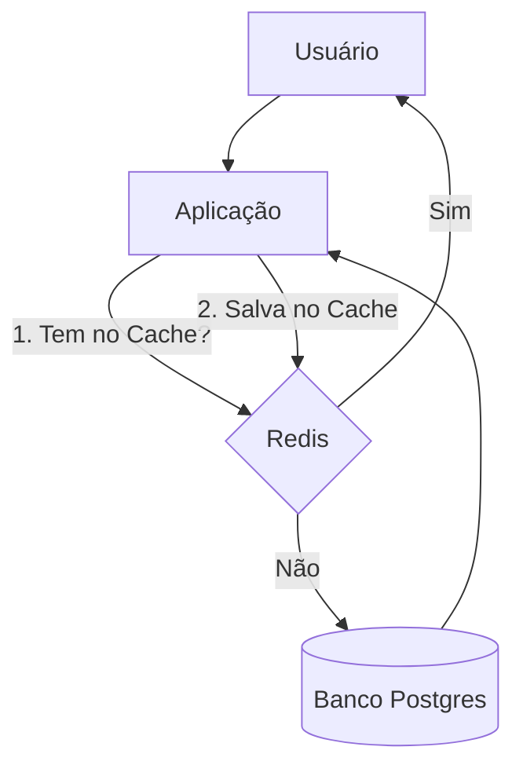
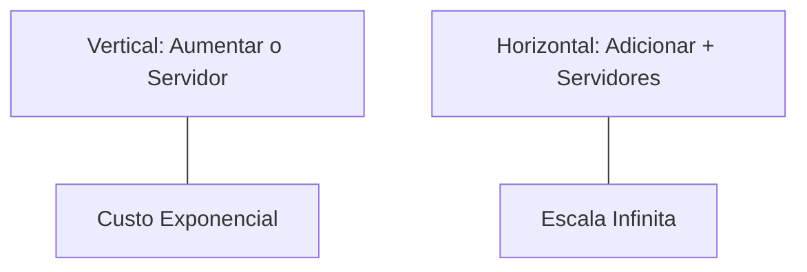

# Aula 07: NoSQL e Cache ⚡

---

## 🎯 Nossa Missão
*   Entender quando o SQL não é suficiente.
*   Conhecer o modelo de Documentos (MongoDB).
*   Dominar o conceito de Cache (Redis).
*   Escalabilidade Horizontal: Pensando grande.

---

## 🦖 O limite do Relacional
Bancos SQL são incríveis, mas:
*   Esquema rígido (alterar tabela é lento). <!-- .element: class="fragment" -->
*   Dificuldade em escalar para bilhões de linhas. <!-- .element: class="fragment" -->
*   Lentidão em requisições repetitivas. <!-- .element: class="fragment" -->
*   **O NoSQL resolve esses gargalos.** <!-- .element: class="fragment" -->

---

## 🧠 O que é NoSQL?
*   **Not Only SQL**. <!-- .element: class="fragment" -->
*   Não usa obrigatoriamente tabelas e colunas. <!-- .element: class="fragment" -->
*   Foco em performance e flexibilidade. <!-- .element: class="fragment" -->
*   Padrão para Big Data e Redes Sociais. <!-- .element: class="fragment" -->

---

## 📂 Tipos de NoSQL
1.  **Documentos**: MongoDB (tipo JSON). <!-- .element: class="fragment" -->
2.  **Chave-Valor**: Redis (ultra rápido). <!-- .element: class="fragment" -->
3.  **Grafos**: Neo4j (relacionamentos complexos). <!-- .element: class="fragment" -->
4.  **Colunares**: Cassandra (dados massivos). <!-- .element: class="fragment" -->

---

## 🍃 MongoDB: O Rei dos Documentos
Em vez de Linhas, usamos **Documentos**.
Em vez de Tabelas, usamos **Collections**.
```json
{
  "_id": "abc123",
  "nome": "João",
  "habilidades": ["Git", "Docker"],
  "ativo": true
}
```

---

## 📐 Por que usar Documentos?
*   **Flexibilidade**: Um documento pode ser diferente do outro. <!-- .element: class="fragment" -->
*   **Agilidade**: Ótimo para MVPs e dados desestruturados. <!-- .element: class="fragment" -->
*   **Hierarquia**: Você pode anular objetos dentro de objetos. <!-- .element: class="fragment" -->

---

## ⚡ Redis: Velocidade Extrema
*   **In-Memory**: Os dados ficam na RAM, não no HD. <!-- .element: class="fragment" -->
*   **Latência**: Respostas em milissegundos. <!-- .element: class="fragment" -->
*   **Estrutura**: Chave-Valor simples. <!-- .element: class="fragment" -->

---

## 🧊 O Conceito de Cache


---

## 🕑 Expiração de Dados (TTL)
No cache, os dados não vivem para sempre.
*   `SET token "abc" EX 3600` (Valido por 1 hora). <!-- .element: class="fragment" -->
*   Evita que o cache fique lotado de lixo antigo. <!-- .element: class="fragment" -->
*   Ideal para sessões de login e tokens. <!-- .element: class="fragment" -->

---

## 🪜 Escalabilidade: Vertical vs Horizontal

*   NoSQL é mestre na escalabilidade **Horizontal**. <!-- .element: class="fragment" -->

---

## 🌐 Onde usar cada um?
*   **E-commerce (Carrinho)**: Redis. <!-- .element: class="fragment" -->
*   **Rede Social (Posts/Feeds)**: MongoDB. <!-- .element: class="fragment" -->
*   **Financeiro (Transações)**: Postgres (SQL). <!-- .element: class="fragment" -->
*   **Logs**: ElasticSearch. <!-- .element: class="fragment" -->

---

## 🔄 Consistência Eventual
O "problema" do NoSQL.
*   Em sistemas gigantes, pode levar milissegundos para o dado sincronizar em todos os servidores. <!-- .element: class="fragment" -->
*   **Exemplo**: O número de likes de uma foto pode variar um pouco entre usuários por instantes. <!-- .element: class="fragment" -->

---

## 🪟 Ferramentas Visuais
*   **MongoDB Compass**: Explorar documentos visualmente. <!-- .element: class="fragment" -->
*   **Beekeeper Studio**: Client moderno para NoSQL e SQL. <!-- .element: class="fragment" -->
*   **Redis Insight**: Monitorar o uso de memória. <!-- .element: class="fragment" -->

---

## 🚀 Performance na Prática
Imagine buscar o perfil de um usuário famoso:
*   No SQL: 50ms (muitos joins). <!-- .element: class="fragment" -->
*   No NoSQL: 10ms (objeto pronto). <!-- .element: class="fragment" -->
*   No Cache: 1ms (direto da RAM). <!-- .element: class="fragment" -->

---

## 📦 Modelagem no MongoDB
"Embed" (Embutir) vs "Link" (Referenciar).
*   Se os dados mudam pouco, salve dentro do documento. <!-- .element: class="fragment" -->
*   Se os dados são gigantes, use a ID (referência). <!-- .element: class="fragment" -->

---

## 🛡️ Quando NÃO usar NoSQL?
*   Quando a integridade dos dados e relações complexas são críticas. <!-- .element: class="fragment" -->
*   Sistemas contábeis e ERPs tradicionais. <!-- .element: class="fragment" -->
*   Quando você não tem volume de dados que justifique a troca. <!-- .element: class="fragment" -->

---

## 📈 O Futuro: Multi-Model
Bancos modernos (como Postgres) já suportam campos JSON.
*   A linha entre SQL e NoSQL está ficando cada vez mais tênue! <!-- .element: class="fragment" -->

---

## 🏆 Checklist NoSQL Pro
*   [ ] Entende o formato JSON/Documento. <!-- .element: class="fragment" -->
*   [ ] Sabe explicar para que serve o Cache. <!-- .element: class="fragment" -->
*   [ ] Reconhece que Redis vive na Memória RAM. <!-- .element: class="fragment" -->
*   [ ] Diferencia escala vertical de horizontal. <!-- .element: class="fragment" -->

---

## 📝 Prática de Hoje
1.  Criar um documento JSON de perfil.
2.  Instalar o MongoDB localmente.
3.  Simular um cenário de cache para uma notícia famosa.

---

## 🏁 Dúvidas?
Otimize seu app para milhões de usuários! 🚀⚡
