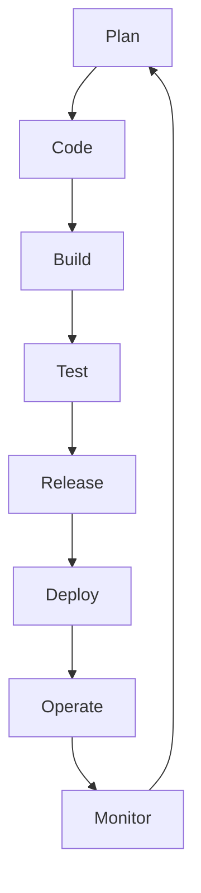
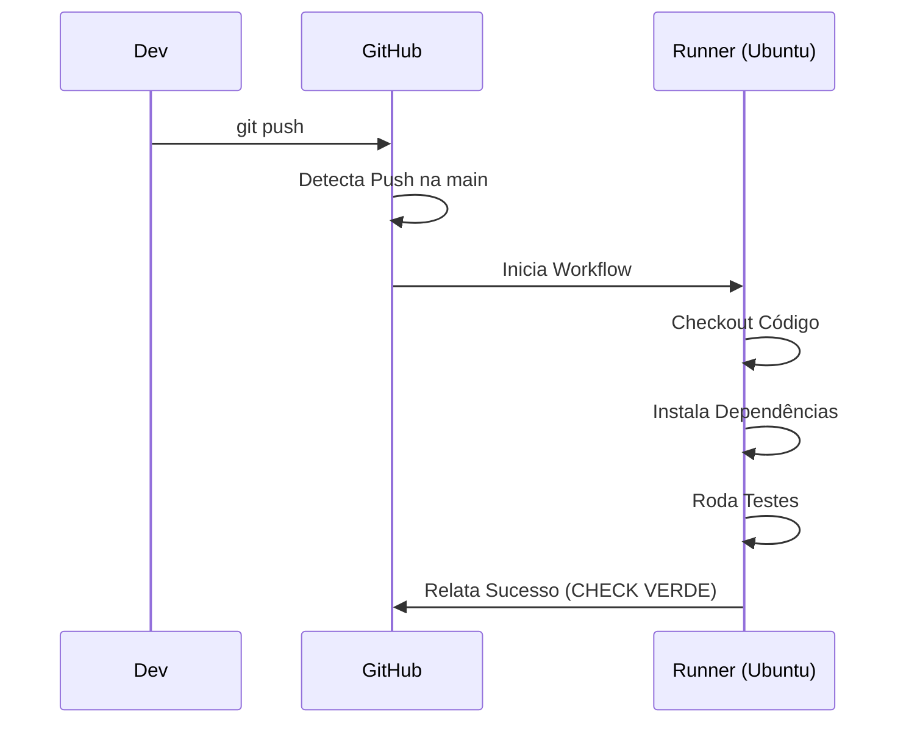

# Aula 11: CI/CD Moderno (GitHub Actions) 🚀

---

## 🎯 Nossa Missão
*   Entender o que é CI e CD.
*   Conhecer o GitHub Actions.
*   Aprender a sintaxe YAML de workflows.
*   Automatizar o ciclo de vida do código.

---

## 🏗️ O que é CI (Continuous Integration)?
Integrar o código com frequência.
*   Testes automáticos rodam a cada push. <!-- .element: class="fragment" -->
*   Erros de integração são pegos cedo. <!-- .element: class="fragment" -->
*   Garante que a `main` nunca quebre. <!-- .element: class="fragment" -->

---

## 🚚 O que é CD (Continuous Delivery/Deployment)?
Entregar o código pronto para o usuário.
*   **Delivery**: Build pronto para ser lançado (clique manual). <!-- .element: class="fragment" -->
*   **Deployment**: Lançamento 100% automático em produção. <!-- .element: class="fragment" -->

---

## ♾️ O Infinito do DevOps


---

## 🐙 Por que GitHub Actions?
*   Integrado ao repositório. <!-- .element: class="fragment" -->
*   Nativamente grátis para repos públicos. <!-- .element: class="fragment" -->
*   Ecossistema gigante de ações prontas. <!-- .element: class="fragment" -->
*   Suporta Linux, Mac e Windows. <!-- .element: class="fragment" -->

---

## 🗂️ A Anatomia do GitHub Actions
1.  **Workflow**: O processo completo (arquivo `.yml`). <!-- .element: class="fragment" -->
2.  **Event (Trigger)**: O que dispara o processo (push, pr). <!-- .element: class="fragment" -->
3.  **Job**: Um conjunto de tarefas em um servidor. <!-- .element: class="fragment" -->
4.  **Step**: Uma tarefa individual (comando ou script). <!-- .element: class="fragment" -->
5.  **Runner**: O servidor virtual que executa tudo. <!-- .element: class="fragment" -->

---

## 📄 O Formato YAML
Yet Another Markup Language.
*   Baseado em indentação (espaços). <!-- .element: class="fragment" -->
*   Muito fácil de ler para humanos. <!-- .element: class="fragment" -->
*   Padrão para ferramentas de DevOps. <!-- .element: class="fragment" -->

---

## 🎯 Gatilhos (Triggers)
Quando a mágica acontece?
```yaml
on:
  push:
    branches: [ main ]
  pull_request:
    branches: [ main ]
```

---

## 🏗️ Definindo o Ambiente (Runner)
Onde seu código vai rodar?
```yaml
jobs:
  meu-teste:
    runs-on: ubuntu-latest
```
*   O GitHub cria uma máquina virtual limpa para você. <!-- .element: class="fragment" -->

---

## 🔨 Passos (Steps)
A lista de tarefas.
```yaml
    steps:
      - uses: actions/checkout@v4
      - name: Rodar Testes
        run: npm test
```
*   `uses`: Usa uma ação pronta da comunidade. <!-- .element: class="fragment" -->
*   `run`: Roda um comando de terminal. <!-- .element: class="fragment" -->

---

## 🤫 Gerenciando Segredos (Secrets)
**NUNCA** escreva senhas no arquivo YAML.
*   Use as **Settings > Secrets** do GitHub. <!-- .element: class="fragment" -->
*   Acesse via: `${{ secrets.MINHA_SENHA }}`. <!-- .element: class="fragment" -->
*   O log do GitHub esconde o valor automaticamente! <!-- .element: class="fragment" -->

---

## 📉 Visualizando a Pipeline


---

## 🧩 Actions Marketplace
Não reinvente a roda! Existem ações prontas para:
*   Enviar mensagem no Slack. <!-- .element: class="fragment" -->
*   Fazer deploy na Amazon (AWS). <!-- .element: class="fragment" -->
*   Escritar código no Docker Hub. <!-- .element: class="fragment" -->
*   Login no Firebase. <!-- .element: class="fragment" -->

---

## 🔄 Cache em Pipelines
Economizando tempo (e dinheiro).
*   Você não precisa baixar as bibliotecas (`node_modules`) do zero a cada vez. <!-- .element: class="fragment" -->
*   O Actions pode guardar o cache e acelerar a build em 50%! <!-- .element: class="fragment" -->

---

## 🛡️ Proteção de Branch
Combine Actions com regras de repositório.
*   Impeça o `merge` se a pipeline falhar. <!-- .element: class="fragment" -->
*   Exija pelo menos 1 aprovação de colega (Code Review). <!-- .element: class="fragment" -->

---

## 📉 Artefatos
Onde fica o arquivo final?
*   Você pode salvar o resultado da build (ex: um `.zip` ou um `.apk`) como artefato para download no final do workflow. <!-- .element: class="fragment" -->

---

## 💰 Custos e Limites
*   Gratuito para Open Source. <!-- .element: class="fragment" -->
*   Minutos limitados para repos privados (2000 min/mês no plano free). <!-- .element: class="fragment" -->

---

## 🏆 Checklist de CI/CD Pro
*   [ ] Entende a diferença entre Workflow, Job e Step. <!-- .element: class="fragment" -->
*   [ ] Sabe criar um arquivo `.yml` básico. <!-- .element: class="fragment" -->
*   [ ] Entende o conceito de Secrets. <!-- .element: class="fragment" -->
*   [ ] Consegue visualizar o log de erro no GitHub. <!-- .element: class="fragment" -->

---

## 📝 Prática de Hoje
1.  Criar a pasta `.github/workflows`.
2.  Criar um workflow de "Hello World".
3.  Ver ele rodar na aba "Actions" após o push.

---

## 🏁 Dúvidas?
Automação é o que separa amadores de profissionais! 🚀🚀