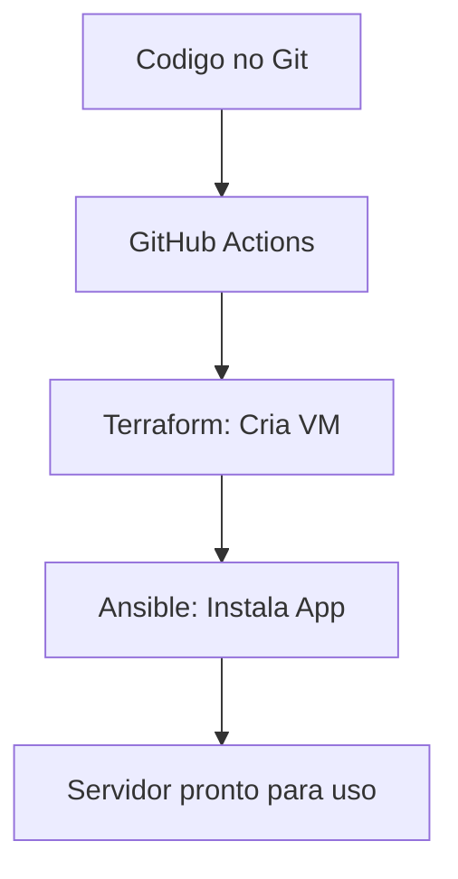

# Aula 12: Automação e IaC (Ansible e Terraform) ⚙️

---

## 🎯 Nossa Missão
*   Entender o conceito de Infraestrutura como Código (IaC).
*   Provisionamento vs Configuração.
*   Conhecer o Terraform (Estatura).
*   Conhecer o Ansible (Recheio).

---

## 😫 O Mundo Antes do IaC
*   Configuração manual de servidores via SSH. <!-- .element: class="fragment" -->
*   "Qual era a senha mesmo?" <!-- .element: class="fragment" -->
*   "Por que o servidor 1 está diferente do servidor 2?" <!-- .element: class="fragment" -->
*   Impossível de escalar ou repetir com precisão. <!-- .element: class="fragment" -->

---

## 🧠 O que é IaC?
Infraestrutura tratada como software.
*   Versionada no Git. <!-- .element: class="fragment" -->
*   Testável. <!-- .element: class="fragment" -->
*   Repetível (Idempotência). <!-- .element: class="fragment" -->
*   Documentação viva do ambiente. <!-- .element: class="fragment" -->

---

## 🏗️ Provisionar vs Configurar
Uma analogia com culinária:
*   **Provisionar (Terraform)**: É comprar a cozinha, o fogão e as panelas. <!-- .element: class="fragment" -->
*   **Configurar (Ansible)**: É ligar o fogo, colocar os ingredientes e cozinhar. <!-- .element: class="fragment" -->

---

## 🌍 Terraform: O Orquestrador de Nuvem
*   Focado em criar os recursos (VMs, Redes, Bancos). <!-- .element: class="fragment" -->
*   Declarativo: Você diz "O que" quer, não "Como" fazer. <!-- .element: class="fragment" -->
*   Multicloud: AWS, Azure, Google Cloud, DigitalOcean. <!-- .element: class="fragment" -->

---

## 📄 Sintaxe HCL (Terraform)
```hcl
resource "aws_instance" "web_server" {
  ami           = "ami-12345"
  instance_type = "t2.micro"
}
```
*   Fácil de ler e gerenciar. <!-- .element: class="fragment" -->

---

## 🔄 O Ciclo do Terraform
1.  **Write**: Escreve o arquivo `.tf`. <!-- .element: class="fragment" -->
2.  **Plan**: Vê o que vai mudar antes de aplicar. <!-- .element: class="fragment" -->
3.  **Apply**: Executa as mudanças na nuvem. <!-- .element: class="fragment" -->
4.  **Destroy**: Remove tudo de uma vez. <!-- .element: class="fragment" -->

---

## 🍳 Ansible: Automação Simples
*   Agentless: Não precisa instalar nada no servidor alvo (usa SSH). <!-- .element: class="fragment" -->
*   Focado em instalar apps e configurar arquivos. <!-- .element: class="fragment" -->
*   Usa Playbooks em YAML. <!-- .element: class="fragment" -->

---

## 📜 Exemplo de Playbook (Ansible)
```yaml
- name: Instalar Nginx
  hosts: servidores_web
  tasks:
    - name: Garantir que Nginx está instalado
      apt:
        name: nginx
        state: present
```

---

## 🔄 Idempotência: A Regra de Ouro
"Se eu rodar 10 vezes, o resultado final é o mesmo."
*   Se o software já está instalado, o Ansible não faz nada. <!-- .element: class="fragment" -->
*   Garante consistência e evita duplicidade de erros. <!-- .element: class="fragment" -->

---

## 🏗️ Estrutura de Infraestrutura Moderna


---

## 🛡️ Benefícios da Automação
*   **Velocidade**: Criar 100 servidores em minutos. <!-- .element: class="fragment" -->
*   **Consistência**: Todos os ambientes (Dev/Prod) são idênticos. <!-- .element: class="fragment" -->
*   **Disaster Recovery**: Recriar tudo do zero após um erro grave. <!-- .element: class="fragment" -->

---

## 🐚 O Papel do YAML e SSH
*   **YAML**: A língua franca da configuração. <!-- .element: class="fragment" -->
*   **SSH**: A porta de entrada segura para a automação. <!-- .element: class="fragment" -->

---

## 📈 Automação além da Infra
*   Backup de bancos de dados. <!-- .element: class="fragment" -->
*   Limpeza de logs. <!-- .element: class="fragment" -->
*   Atualização de patches de segurança de uma só vez. <!-- .element: class="fragment" -->

---

## 💰 Cloud Computing e IaC
*   **Pay-as-you-go**: Pague só pelo que usa. <!-- .element: class="fragment" -->
*   O IaC ajuda a desligar recursos que não estão sendo usados e economizar dinheiro! <!-- .element: class="fragment" -->

---

## 🕵️‍♂️ Verificação de Conformidade
*   Ferramentas que verificam se a infraestrutura real é igual ao que está no código. <!-- .element: class="fragment" -->
*   Evita o "Desvio de Configuração" (Config Drift). <!-- .element: class="fragment" -->

---

## 🏆 Checklist de Automação Pro
*   [ ] Entende a diferença entre Terraform e Ansible. <!-- .element: class="fragment" -->
*   [ ] Sabe que IaC deve estar no Git. <!-- .element: class="fragment" -->
*   [ ] Entende o conceito de Idempotência. <!-- .element: class="fragment" -->
*   [ ] Conhece o básico da sintaxe YAML. <!-- .element: class="fragment" -->

---

## 📝 Prática de Hoje
1.  Escrever um Playbook Ansible fictício.
2.  Analisar um arquivo de configuração Terraform.
3.  Desenhar o fluxo de criação de um servidor.

---

## 🏁 Dúvidas?
A infraestrutura agora é código! 🚀⚙️