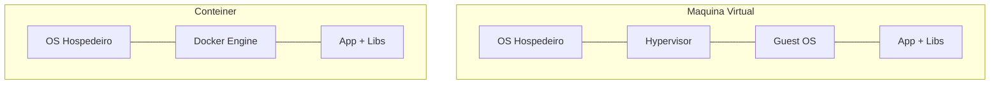
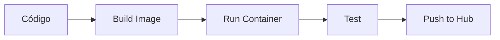

# Aula 13: Contêineres com Docker 📦

---

## 🎯 Nossa Missão
*   Resolver o problema "na minha máquina funciona".
*   Entender a tecnologia de contêineres.
*   Dominar Dockerfiles e Imagens.
*   Orquestração local com Docker Compose.

---

## 😫 O Conflito de Versões
*   Projeto A precisa de Node 14. <!-- .element: class="fragment" -->
*   Projeto B precisa de Node 18. <!-- .element: class="fragment" -->
*   Seu computador vira uma bagunça de versões conflitantes. <!-- .element: class="fragment" -->
*   **O Docker isola tudo isso.** <!-- .element: class="fragment" -->

---

## 🐳 O que é o Docker?
Não é uma máquina virtual!
*   **Contêiner**: Um processo isolado que compartilha o kernel do S.O. <!-- .element: class="fragment" -->
*   **Imagem**: O "molde" ou fotografia do sistema pronto. <!-- .element: class="fragment" -->
*   **Docker Hub**: Onde baixamos as imagens prontas. <!-- .element: class="fragment" -->

---

## ⚖️ VM vs Contêiner

*   Contêineres são muito mais leves e rápidos. <!-- .element: class="fragment" -->

---

## 📜 O Dockerfile: A Receita
```dockerfile
# 1. Base (Qual S.O.?)
FROM node:20-alpine
# 2. Pasta de trabalho
WORKDIR /app
# 3. Copiar arquivos
COPY . .
# 4. Instalar dependencias
RUN npm install
# 5. Comando de inicio
CMD ["npm", "start"]
```

---

## 🛠️ Comandos Essenciais (Build)
*   `docker build -t meu-app .`: Criar a imagem. <!-- .element: class="fragment" -->
*   `docker images`: Listar imagens no PC. <!-- .element: class="fragment" -->
*   `docker rmi <id>`: Deletar imagem. <!-- .element: class="fragment" -->

---

## 🚀 Comandos Essenciais (Run)
*   `docker run -p 8080:80 meu-app`: Rodar o app. <!-- .element: class="fragment" -->
*   `docker ps`: Ver o que está rodando. <!-- .element: class="fragment" -->
*   `docker stop <id>`: Parar o contêiner. <!-- .element: class="fragment" -->
*   `docker exec -it <id> sh`: Entrar no contêiner. <!-- .element: class="fragment" -->

---

## 🔗 Mapeamento de Portas
`8080:80`
*   **8080**: Porta do seu computador (Host). <!-- .element: class="fragment" -->
*   **80**: Porta dentro do Docker (Container). <!-- .element: class="fragment" -->
*   Permite acessar o serviço via browser no seu PC. <!-- .element: class="fragment" -->

---

## 📂 Volumes: Persistência de Dados
Contêineres são efêmeros (se deletar, os dados somem).
*   **Volumes** conectam uma pasta do seu HD à pasta do Docker. <!-- .element: class="fragment" -->
*   Os dados sobrevivem mesmo se o contêiner for destruído. <!-- .element: class="fragment" -->

---

## 🗺️ Docker Compose: O Maestro Local
E se eu precisar de uma API + Banco de Dados?
*   Arquivo `docker-compose.yml`. <!-- .element: class="fragment" -->
*   Define todos os serviços e suas redes. <!-- .element: class="fragment" -->
*   Comando: `docker-compose up`. <!-- .element: class="fragment" -->

---

## 🏗️ Exemplo de Docker Compose
```yaml
services:
  web:
    build: .
    ports: ["3000:3000"]
  db:
    image: postgres:alpine
    environment:
      POSTGRES_PASSWORD: root
```

---

## 🌐 Redes no Docker (Networks)
*   Contêineres podem falar uns com os outros pelo nome. <!-- .element: class="fragment" -->
*   Isolamento de tráfego para maior segurança. <!-- .element: class="fragment" -->

---

## 🦁 Otimizando Imagens
*   Use imagens `alpine` (ultra leves). <!-- .element: class="fragment" -->
*   Evite instalar ferramentas desnecessárias na imagem. <!-- .element: class="fragment" -->
*   Use `.dockerignore` para não copiar o `node_modules` local. <!-- .element: class="fragment" -->

---

## 🛡️ Segurança no Docker
*   Não rode o app como usuário `root` dentro do Docker. <!-- .element: class="fragment" -->
*   Mantenha suas imagens base sempre atualizadas. <!-- .element: class="fragment" -->
*   Use ferramentas de scan de vulnerabilidades. <!-- .element: class="fragment" -->

---

## 📉 Ciclo de Desenvolvimento Docker


---

## 🌟 O Futuro: DevContainers
*   Use o Docker para configurar seu ambiente de VS Code. <!-- .element: class="fragment" -->
*   Todo o time usa exatamente as mesmas extensões e ferramentas. <!-- .element: class="fragment" -->

---

## 🏆 Checklist de Docker Pro
*   [ ] Entende a diferença entre Imagem e Contêiner. <!-- .element: class="fragment" -->
*   [ ] Sabe escrever um Dockerfile básico. <!-- .element: class="fragment" -->
*   [ ] Consegue rodar um banco de dados via Docker. <!-- .element: class="fragment" -->
*   [ ] Entende para que serve o Docker Compose. <!-- .element: class="fragment" -->

---

## 📝 Prática de Hoje
1.  Criar um Dockerfile para um site estático.
2.  Fazer o Build e conferir o tamanho da imagem.
3.  Rodar o contêiner e acessar via navegador.

---

## 🏁 Dúvidas?
Contêineres mudaram o mundo do software! 🚀📦
