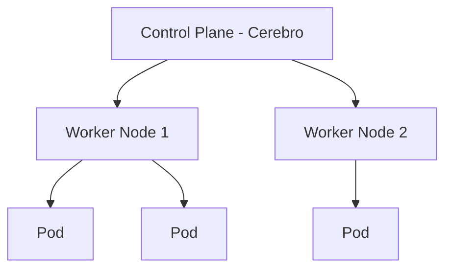

# Aula 14: Orquestração com Kubernetes e Runners ☸️

---

## 🎯 Nossa Missão
*   Entender a necessidade da orquestração.
*   Conhecer a arquitetura do Kubernetes (K8s).
*   Descobrir o que são Pods, Nodes e Clusters.
*   Compreender o papel dos Runners em CI/CD.

---

## 🤔 Por que Kubernetes?
O Docker é ótimo para 1 servidor. E para 1000?
*   Quem reinicia o contêiner se ele cair? <!-- .element: class="fragment" -->
*   Como dividir o tráfego entre 10 cópias do app? <!-- .element: class="fragment" -->
*   Como atualizar o sistema sem tirar ninguém do ar? <!-- .element: class="fragment" -->
*   **O Kubernetes é o maestro dessa orquestra.** <!-- .element: class="fragment" -->

---

## 🏗️ Arquitetura do Cluster


---

## 🧠 Control Plane vs Worker Nodes
*   **Control Plane**: Toma decisões (agendamento, detecção de falhas). <!-- .element: class="fragment" -->
*   **Worker Nodes**: Os servidores que carregam o peso (onde o app roda). <!-- .element: class="fragment" -->

---

## 📦 O que é um Pod?
A menor peça do quebra-cabeça.
*   Um Pod pode ter um ou mais contêineres colados. <!-- .element: class="fragment" -->
*   Eles compartilham o mesmo IP e o mesmo volume. <!-- .element: class="fragment" -->
*   O Kubernetes gerencia Pods, não contêineres isolados. <!-- .element: class="fragment" -->

---

## 🛠️ Objetos Essenciais
1.  **Deployment**: Define como seu app deve rodar (quantas cópias). <!-- .element: class="fragment" -->
2.  **Service**: Cria um IP fixo para acessar seus Pods. <!-- .element: class="fragment" -->
3.  **Ingress**: A porta de entrada do cluster (o que o mundo vê). <!-- .element: class="fragment" -->

---

## 🩹 Auto-Cura (Self-Healing)
*   Se um contêiner morre, o K8s reinicia. <!-- .element: class="fragment" -->
*   Se um servidor morre, o K8s move os Pods para outro servidor disponível. <!-- .element: class="fragment" -->
*   Seu sistema fica sempre online (High Availability). <!-- .element: class="fragment" -->

---

## 🪜 Auto-Escala (Scaling)
*   **HPA**: Aumenta o número de Pods se o tráfego subir. <!-- .element: class="fragment" -->
*   **VPA**: Dá mais CPU/RAM se o processo estiver pesado. <!-- .element: class="fragment" -->
*   **Cluster Autoscaler**: Compra mais servidores reais na Amazon/Google se precisar de mais espaço. <!-- .element: class="fragment" -->

---

## 🚀 Deployment Estratégico
Como atualizar o código sem erros?
*   **Rolling Update**: Troca um por um, sem downtime. <!-- .element: class="fragment" -->
*   **Canary Deployment**: Libera a versão nova apenas para 5% dos usuários primeiro. <!-- .element: class="fragment" -->
*   **Blue/Green**: Sobe o novo app ao lado do antigo e vira a chave. <!-- .element: class="fragment" -->

---

## 📄 Manifestos YAML
Tudo no K8s é declarado em arquivos.
```yaml
apiVersion: apps/v1
kind: Deployment
metadata:
  name: meu-app
spec:
  replicas: 3
  template:
    spec:
      containers:
      - name: web
        image: meu-app:v2
```

---

## 🐚 kubectl: O Controle Remoto
A ferramenta de linha de comando para falar com o K8s.
*   `kubectl get pods`: Ver quem está vivo. <!-- .element: class="fragment" -->
*   `kubectl logs <pod>`: Ver os erros. <!-- .element: class="fragment" -->
*   `kubectl apply -f arquivo.yml`: Enviar ordens para o cluster. <!-- .element: class="fragment" -->

---

## 🏃‍♂️ O que são Runners?
Conectando a Orquestração com o CI/CD.
*   Runners são as máquinas que executam seus testes. <!-- .element: class="fragment" -->
*   Eles podem ser contêineres rodando dentro do seu próprio Kubernetes! <!-- .element: class="fragment" -->
*   **Self-hosted Runners**: Mais segurança e controle de custos. <!-- .element: class="fragment" -->

---

## 🏢 K8s Gerenciado (Cloud)
Instalar o K8s do zero é muito difícil!
*   **AWS EKS** <!-- .element: class="fragment" -->
*   **Google GKE** <!-- .element: class="fragment" -->
*   **Azure AKS** <!-- .element: class="fragment" -->
*   A nuvem cuida do Control Plane pra você. <!-- .element: class="fragment" -->

---

## 🌐 Networking e DNS
No K8s, um serviço pode achar outro apenas pelo nome:
*   `api-service` consegue falar com `db-service` sem saber o IP real! <!-- .element: class="fragment" -->

---

## 🛡️ RBAC: Segurança no Cluster
*   Quem pode criar Pods? <!-- .element: class="fragment" -->
*   Quem pode ver os logs? <!-- .element: class="fragment" -->
*   O Kubernetes permite controle total de permissões por usuário. <!-- .element: class="fragment" -->

---

## 🏆 Checklist de Orquestração Pro
*   [ ] Entende o papel do Control Plane. <!-- .element: class="fragment" -->
*   [ ] Sabe que um Pod é a unidade mínima. <!-- .element: class="fragment" -->
*   [ ] Compreende o conceito de Réplicas e Auto-Cura. <!-- .element: class="fragment" -->
*   [ ] Sabe para que serve o `kubectl`. <!-- .element: class="fragment" -->

---

## 📝 Prática de Hoje
1.  Explorar a arquitetura visual de um cluster K8s.
2.  Analisar um manifesto YAML de Deployment.
3.  Diferenciar o papel do Runner no GitHub Actions.

---

## 🏁 Dúvidas?
Bem-vindo ao mundo da alta disponibilidade! ☸️🚀
